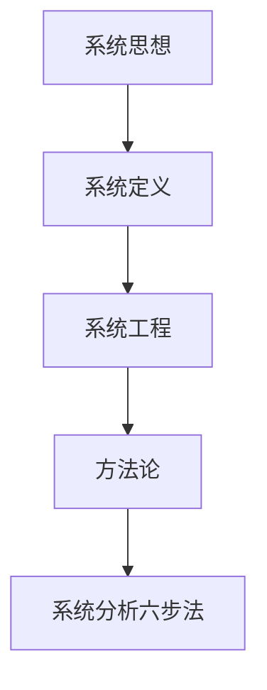

# 第3章 系统分析

> 课件：`工程概论 I 03——系统分析.pdf` | 重要度：★★☆ | 建议复习：1.5h  
> 对照：[课程整体要求.md](../课程整体要求.md)

## 本章考点一览

1. **必背**：系统思想核心——整体大于部分之和；系统分析六步法
2. **必答**：丁谓修宫案例（问题拆解→一体化方案→一举三役）
3. **必记**：系统 vs 系统工程 vs 系统分析的区别
4. **了解**：霍尔三维结构、软系统（切克兰德）各解决什么类问题
5. **联系项目**：用系统思维写「方案对全局的影响」

---

## 本章在课程中的位置

- 落实课程目标3：复杂工程问题要用**系统思维**看相互制约关系，而不是只优化局部。
- 与绪论「全周期」互补：全周期管时间维度，系统分析管**要素关联**维度。

## 知识脉络

---

## 知识点精讲

### 3.1 系统思想与系统思维

#### 【定义】

**系统**：由相互联系、相互依赖、相互制约、相互作用的要素构成的**有机整体**（辩证唯物主义：物质世界普遍联系）。

**系统思维**：从整体上考虑问题，关注要素之间关系，而非孤立优化局部。

#### 【通俗理解】

- 修宫殿不只是「盖房子」，还牵涉取土、运输、垃圾处理——拆开看是三个麻烦，合起来设计可以**一个方案解决三个问题**。
- 大工程（三峡、阿波罗）都是「技术+社会+经济+环境」多目标系统。

#### 【★★★】丁谓修宫——五步答题模板

| 步骤 | 内容 |
|------|------|
| 1 原问题 | 修宫需大量土石建材，旱道运输成本高、工期紧 |
| 2 子问题 | ①取土 ②运材 ③清废墟 |
| 3 系统方案 | 挖沟取土烧砖 → 沟注水运材 → 完工填沟处理垃圾 |
| 4 效果 | 「一举而三役济」（《梦溪笔谈》） |
| 5 考点 | **整体优化**优于局部最优 |

**重要度依据**：课件经典案例，简答/论述高频。

#### 【★☆☆】大系统案例

- **阿波罗计划**：多机构协作、技术与管理集成。
- **三峡工程**：防洪、发电、航运、移民、生态等多目标权衡。

### 3.2 系统与系统工程

#### 【定义】系统工程

运用**系统观点**和**定量/定性方法**，对大型复杂工程进行规划、设计、实施与运行的组织管理活动，追求**整体最优**而非局部最优。

#### 【易错易混】

| 术语 | 侧重点 |
|------|--------|
| 系统思想 | 哲学/思维层面：整体观 |
| 系统工程 | 实践层面：组织与管理大型工程 |
| 系统分析 | 方法层面：问题→方案→评价→决策 |

#### 【★★☆】系统观演化（了解）

古代朴素整体观 → 近代分析还原（只见树木）→ 现代科学系统观（见树又见林，定性与定量结合）。钱学森：系统思想在哲学、运筹学、系统工程中各有表达形式。

### 3.3–3.4 方法论与系统分析

#### 【★★★】系统分析一般步骤

1. **明确问题**（目标、边界、约束）  
2. **确定目标**（可度量）  
3. **提出备选方案**  
4. **建立模型**（数学、仿真、逻辑）  
5. **评价方案**（技术、经济、社会、环境）  
6. **决策与实施**（选优、反馈）

#### 【★★☆】常用方法论（一句话）

| 方法 | 适用 |
|------|------|
| 霍尔三维结构 | 硬系统、结构清晰：时间×逻辑×知识维 |
| 切克兰德软系统 | 目标不清、人的因素多：学习→根定义→比较 |
| 并行工程 | 设计/工艺/供应链早期并行，缩短周期 |

---

## 关键概念对比表

| | 还原论 | 系统论 |
|---|--------|--------|
| 视角 | 分解、局部 | 关联、整体 |
| 风险 | 局部最优≠整体最优 | 需协调多目标 |
| 工程例 | 只优化零件成本 | 同时看供应链、维护、报废 |

---

## 案例剖析：丁谓修宫（论述题 200 字版）

**事实→考点→话术**  
- 事实：三个独立难题（土、运、垃圾）。  
- 考点：系统优化、接口设计。  
- 话术：「将取土、水运、填沟串联为同一空间链路，降低运输与处置成本，体现系统思维下多目标协同，而非分项逐个解决。」

---

## 本章小结

1. **系统思维** = 看关系、看整体、看多目标。  
2. **丁谓修宫**是必背简答素材。  
3. **系统分析六步法**可套进项目报告「方案比选」一节。  
4. 系统工程 ≠ 单纯项目管理，更强调技术与组织集成。  
5. 与第8章经济评价结合：方案评价要同时有技术模型与经济指标。

---

## 自测清单

- [ ] 默写系统分析六步法  
- [ ] 2 分钟内讲清丁谓修宫系统方案  
- [ ] 区分系统思想、系统工程、系统分析各 1 句
