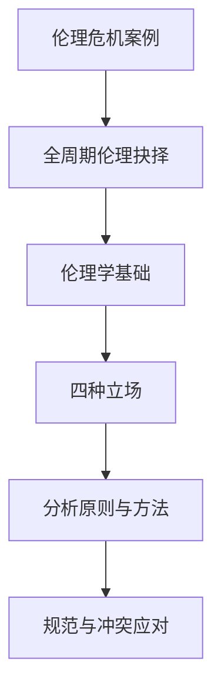

# 第4章 工程与伦理

> 课件：`4 工程与伦理 .pdf` | 重要度：★★★ | 建议复习：2h  
> 对照：[课程整体要求.md](../课程整体要求.md)

## 本章考点一览

1. **必背**：《工程伦理守则》生命至上——公众安全、健康、福祉、生态优先
2. **必答**：四种伦理立场（功利、义务、美德、权利）及适用情境
3. **必背案例**：挑战者号——技术、决策、组织、公正四维分析
4. **必答**：伦理在全周期各阶段（概念→生命周期）的抉择点
5. **了解**：伦理 vs 道德；工程师利益/角色/价值冲突应对

---

## 本章在课程中的位置

- 期末论述、项目报告**非技术因素**核心章。
- 与第5章法律（底线）、第6章可持续（环境责任）形成「责任三角」。

## 知识脉络

---

## 知识点精讲

### 4.1 工程伦理概述

#### 【定义】

- **伦理**：处理人与人、人与社会、人与自然关系应遵循的规则（偏社会、客观、普遍）。
- **道德**：个人内在的善恶标准与德性（偏主观、情境）。
- **工程伦理学**：研究工程中道德问题，对工程行为作道德论证的学科。

#### 【★★★】生命至上（答题首句）

《中国工程师联合体工程伦理守则》第一条：**把公众的安全、健康和福祉以及生态环境保护放在首位。**

IEEE 亦强调：工程不仅是技术问题，更是道德问题。

#### 【★★☆】工程伦理规范特征

| 特征 | 含义 |
|------|------|
| 禁止性 | 不得损害公众安全等底线 |
| 预防性 | 事前识别风险、前瞻分析后果 |
| 激励性 | 树立职业理想与榜样 |

### 4.2–4.3 伦理立场与分析

#### 【★★★】四种伦理立场对比表

| 立场 | 核心问题 | 判断标准 | 优点 | 局限 | 典型题 |
|------|----------|----------|------|------|--------|
| **功利论** | 什么后果最好？ | 最大多数人最大幸福；成本效益 | 便于量化比较方案 | 可能牺牲少数人 | 是否值得为千人实验牺牲百人？ |
| **义务论** | 什么行为正当？ | 可普遍化准则；人作为目的 | 保护权利与尊严 | 僵化、难处理冲突义务 | 能否撒谎保护他人？ |
| **美德论** | 什么样的人？ | 诚信、勇敢、负责任 | 塑造职业文化 | 标准因文化而异 | 工程师应具备何种品格？ |
| **权利论** | 权利是否被侵犯？ | 基本人权不可权衡 | 保护弱势群体 | 权利冲突时难决 | 知情权 vs 保密 |

#### 【通俗理解】考试怎么选立场

- 算总收益、比方案 → 先写**功利论**框架，再补义务论「是否侵犯基本权利」。
- 涉及隐瞒信息、强制实验 → 优先**义务论/权利论**批判。

### 4.4 全周期中的伦理

| 阶段 | 伦理抉择举例 |
|------|--------------|
| 概念 | 目标是否损害公众？市场 vs 安全 |
| 计划 | 经济决策是否忽视安全冗余 |
| 开发 | 可维护性、可靠性是否偷工减料 |
| 验证 | 极端测试是否充分 |
| 发布 | 已知缺陷是否隐瞒上市 |
| 生命周期 | 报废、污染、数据隐私 |

### 4.5 工程师规范与冲突

- **利益冲突**：个人经济利益 vs 雇主 vs 公众  
- **角色冲突**：技术专家 vs 管理者 vs 代言人  
- **价值观冲突**：效率 vs 公平 vs 环保  

**应对**：披露冲突、寻求第三方审查、拒绝违法违规指令、记录并报告安全隐患（结合挑战者号）。

---

## 关键概念对比表

| | 法律 | 伦理 |
|---|------|------|
| 约束力 | 国家强制 | 职业规范+内心自律 |
| 底线 | 不得违法 | 不得漠视公众安全 |
| 案例 | 进网许可 | 挑战者号发射决策 |

---

## 案例剖析：挑战者号（论述题模板）

### 事实摘要

- 1986年1月28日发射，73秒后解体，7名航天员遇难。  
- 直接技术原因：右侧固体火箭**O型环**在低温下密封失效，不稳定气流加剧泄漏。

### 分维度分析（课件要点）

| 维度 | 问题 | 答题句 |
|------|------|--------|
| **生产安全** | O型环设计未考虑极低温使用极限 | 技术预见不足，未留安全裕度 |
| **公共安全** | 已知风险仍发射；残骸可能二次伤害 | 将风险转嫁给公众 |
| **社会公正** | 公众知情权不足；信息不透明 | 违背知情同意原则 |
| **职业精神** | 工程师警告被管理层忽视；无发射逃生系统 | 未坚持「安全否决权」 |

### 答题结构（建议 300 字）

1. **立场**：违背生命至上与预防性伦理。  
2. **技术链**：密封失效→解体。  
3. **组织链**：压力赶工期→忽视 dissent。  
4. **规范链**：应暂停发射、完善应急。  
5. **启示**：工程师对公众负有**优先于雇主**的道德责任。

### 变式

- 若问「用功利论辩护发射」→ 指出短期政治收益 vs 长期生命损失，功利计算亦失败。  
- 若问「义务论」→ 不能将航天员仅作手段。

---

## 本章小结

1. 开篇先写**生命至上**。  
2. **四立场表**背熟，论述题先定性再选立场。  
3. **挑战者号**四维模板可套其他事故（福岛、波音787质量等）。  
4. 伦理嵌入**七阶段**，别只写「要重视伦理」一句空话。  

---

## 自测清单

- [ ] 默写四伦理立场各 1 句核心  
- [ ] 5 分钟写完挑战者号四维分析  
- [ ] 列举全周期 3 个伦理风险点
