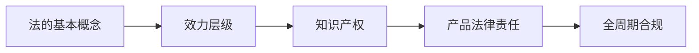

# 第5章 工程与法律法规

> 课件：`5 工程与法律法规 .pdf` | 重要度：★★☆ | 建议复习：1.5h  
> 对照：[课程整体要求.md](../课程整体要求.md)

## 本章考点一览

1. **必背**：法律效力层级（宪法＞法律＞行政法规＞地方性法规＞规章）
2. **必答**：工程活动须在法律框架内；合规先于技术可行
3. **案例**：手机进网许可（法规依据 + 标志三行含义）
4. **案例**：青蒿素专利（原创 vs 国际市场、专利许可）
5. **了解**：知识产权类型；产品责任与开发阶段关系

---

## 本章在课程中的位置

- 课程目标4「法规约束」的展开；项目报告**非技术因素**必写块之一。
- 与第6章「标准」配合：法是**底线**，标准是**技术要求**。

## 知识脉络



---

## 知识点精讲

### 5.1 法律基础知识

#### 【定义】

- **法**：通过规范人的行为调整社会关系，以实现正义秩序（人权保障为目标）。
- **法律**：有立法权的机关依程序制定的规范性文件。
- **法规**：行政法规、地方性法规等。
- **规章**：行政机关依程序发布的具有普遍约束力的文件。

#### 【★★★】效力等级（必背顺序）

```
宪法（最高）
  ↓
法律
  ↓
行政法规
  ↓
地方性法规
  ↓
规章（部门规章、地方政府规章；彼此可能交叉，不宜简单比高低）
```

**【通俗理解】**下位不得与上位抵触；工程立项要查**行业行政法规 + 国标/行标**是否同时满足。

#### 【★★★】工程与法

> 任何工程活动都必须在法律框架内进行，**合规性是技术可行性的前提**。（课件开篇）

### 5.2 知识产权

#### 【定义】

对智力成果享有的专有权利，常见：**专利、商标、著作权、商业秘密**。

#### 【易错易混】

| 类型 | 保护对象 | 工程场景 |
|------|----------|----------|
| 专利 | 技术方案 | 产品核心算法、结构 |
| 商标 | 标识 | 品牌、App 图标 |
| 著作权 | 表达形式 | 文档、代码（需注意职务作品归属） |
| 商业秘密 | 未公开信息 | 工艺参数、客户名单 |

工程师义务：不侵犯他人 IP；保护本单位成果；合同明确归属与许可。

### 5.3 产品开发与法律责任

- **产品质量责任**：缺陷致损→赔偿（无过错/Product liability 视法系而定，答题按课件）。
- **合同责任**：不按约定交付→违约。
- **侵权责任**：侵害他人权益。
- 设计阶段选型错误、制造阶段工艺失控、销售阶段隐瞒缺陷——责任主体与举证可能不同。

---

## 关键概念对比表

| | 法律 | 标准（第6章） |
|---|------|----------------|
| 性质 | 国家强制力 | 常自愿（GB 强制除外） |
| 违反后果 | 违法责任 | 不合格、无法入网/上市 |
| 例 | 电信条例 | GB/T 检测方法 |

---

## 案例剖析

### 案例1：手机进网许可证

**事实**  
- 每款手机上市前须取得进网许可（有效期 3 年）；标志含三行信息。

**考点**  
- 《电信条例》+《电信设备进网管理办法》  
- 许可 = 合法销售凭证；可官网查 21 位编码验真

**答题话术（简答）**  
「进网许可是国家对无线电通信设备市场准入的行政许可；标志第二行为型号，第三行为唯一编码，体现工程产品须满足法定准入条件后方可上市。」

### 案例2：青蒿素与专利

**事实**  
- 中国科学家发现青蒿素；复方蒿甲醚与诺华许可协议，国际销售权在诺华。

**考点**  
- **专利布局**与**国际化**决定产业利益；科研突破 ≠ 市场主导

**答题话术**  
「说明工程师除研发外须重视知识产权战略与许可谈判，否则可能造成巨大经济损失（课件：年损失估十几亿美元量级）。」

---

## 本章小结

1. 先**合法**再谈**先进**。  
2. 效力金字塔 + 两个案例（进网、青蒿素）是简答主力。  
3. IP 写项目报告时要有「谁拥有、是否侵权、如何许可」。  
4. 法与标准、伦理并列，构成非技术约束三角。  

---

## 自测清单

- [ ] 默写法律效力从高到低 4 级  
- [ ] 说清进网标志三行各表示什么  
- [ ] 用 3 句话说明青蒿素案例的工程启示
