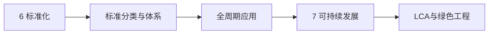

# 第6–7章 工程与标准化、可持续发展

> 课件：`6.7 工程与标准化、可持续发展.pdf` | 重要度：标准化 ★★☆ / 可持续 ★★★ | 建议复习：2h  
> 对照：[课程整体要求.md](../课程整体要求.md)

## 本章考点一览

1. **必背**：GB（强制）与 GB/T（推荐）区别；标准是全周期市场准入前提
2. **必答**：标准 vs 技术法规（WTO：法规强制、标准自愿）
3. **必记**：标准化定义；标准在全周期各阶段的作用
4. **必答**：可持续发展内涵；工程师环境责任
5. **了解**：LCA 四步框架（目标与范围→清单→影响评价→解释）

---

## 本章在课程中的位置

- 目标4「行业规范」：标准是产品能否上市、互操作的**技术门槛**。
- 目标4「环境约束」：可持续与绿色工程是项目报告非技术分析常见块。

## 知识脉络

---

## 知识点精讲

### 6 工程与标准化

#### 【定义】标准（GB/T 20000.1 / ISO）

经公认机构批准的文件，规定**通用或重复使用**的规则、特性或指南，基于科学、技术与经验，促进最佳公共利益。

**标准化**：制定、发布、实施标准的活动。

#### 【通俗理解】

- 「没有规矩，不成方圆」——子弹卡壳、过山车轨道差 3mm、电压不匹配，都是**未按标准**的代价。
- 比尔·盖茨：标准化使软硬件资源共享成为现实。

#### 【★★★】标准与产品开发

**产品满足标准是进入市场的前提**（课件强调）。在全周期中：

| 阶段 | 标准作用举例 |
|------|--------------|
| 概念/计划 | 行业标准、安全规范可行性 |
| 开发 | 设计规范、材料标准 |
| 验证 | 测试方法标准（GB/T） |
| 发布/生命周期 | 认证、环保排放标准 |

#### 【★★☆】标准分类

| 维度 | 类型 | 代号/例 |
|------|------|---------|
| 强制力 | 强制性国家标准 | GB |
| 强制力 | 推荐性国家标准 | GB/T |
| 层级 | 国际 ISO/IEC、国家、行业、地方、企业 | |
| WTO | 技术法规（强制） | 如网络安全法要求 |
| WTO | 标准（自愿） | GB/T 8756 等 |

#### 【易错易混】

| 概念 | 区别 |
|------|------|
| 标准 vs 规范 | 常混用；规范可指技术规范文件，标准是最基本形式 |
| 标准 vs 法律 | 法管行为与责任；标准管技术一致性；部分 GB 具有法律效力 |

### 7 工程与可持续发展

#### 【定义】

既满足当代需要，又**不损害后代**满足其需要能力的发展模式；要求经济、社会、环境协调。

#### 【★★★】工程师责任

- 资源节约、污染预防、生态恢复  
- **绿色工程**：从源头减量、清洁生产、循环利用  
- **循环经济**：减量化、再利用、资源化  

#### 【★★☆】生命周期评价 LCA（答题框架）

| 步骤 | 内容 |
|------|------|
| 1 目标与范围 | 评什么产品、边界、功能单位 |
| 2 清单分析 | 各阶段资源消耗与排放数据 |
| 3 影响评价 | 碳足迹、酸化、毒性等归类 |
| 4 解释 | 结论、敏感性、改进建议 |

**【通俗理解】**LCA 回答「从摇篮到坟墓」环境影响有多大，用于比选材料或工艺。

---

## 关键概念对比表

| | GB | GB/T | 技术法规 |
|---|-----|------|----------|
| 性质 | 可强制 | 推荐 | 强制 |
| 违反 | 不得生产/销售 | 竞争力/认证 | 法律责任 |
| 例 | 安全限值 | 测试方法 | 进网、RoHS 类指令 |

---

## 案例剖析：标准失效的后果（课件幽默案例）

**事实**：子弹未按标准生产卡壳、双人伞、电压 120V 差异等。  
**考点**：标准不是「可有可无的文档」，而是**安全与互操作**保障。  
**话术**：「说明标准化是风险控制手段，贯穿设计—制造—检验全链条。」

---

## 本章小结

1. **GB vs GB/T** 必背；进网、RoHS 等是「法规+标准」组合。  
2. 标准在全周期**每个阶段**都要对表检查。  
3. 可持续答题抓：**代际公平 + 绿色/循环 + LCA 四步**。  
4. 与伦理章「环境伦理」、法律章「环保法规」一起写项目非技术章节。  

---

## 自测清单

- [ ] 解释 GB 与 GB/T  
- [ ] 写出 LCA 四个步骤名称  
- [ ] 说明标准在「验证阶段」的作用
