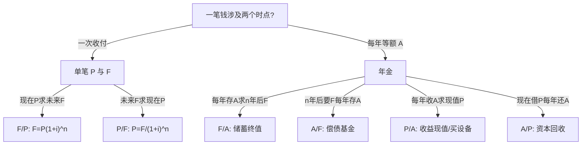

# 第8章 工程项目经济决策基础

> 课件：`8 工程项目经济决策基础.pdf` | 重要度：★★★ | 建议复习：4–5h  
> 对照：[课程整体要求.md](../课程整体要求.md) | 范围：8.1–8.5

## 本章考点一览

1. **必算**：现金流量图、净现金流量表；复利终值、年金六系数查表
2. **必背**：沉没成本 vs 机会成本；生产要素法总成本构成
3. **必算**：完全成本法 / 变动成本法利润表（课件两例数字）
4. **必答**：项目论证含义与作用；资金时间价值「不能跨年直接相加」
5. **了解**：软件 FP/CoCoMo 组织型估算（例 2-5）

---

## 本章在课程中的位置

- 期末**计算题主战场之一**；为第9章 NPV、PBT、IRR 提供现金流与折现基础。
- 逻辑链：**为什么要论证 → 花多少钱(成本) → 赚多少钱(收入利润) → 投多少钱 → 钱的时间价值(等值换算)**。

## 知识脉络


---

## 知识点精讲

### 8.1 工程经济决策概述

#### 【定义】

在项目早期从**经济角度**评价技术方案；实施中**成本控制**；避免投资失误。

#### 【★★★】项目论证

对拟建项目从市场预测起，研究规模、工艺、厂址、投资、成本、风险等，评价必要性、先进性、**经济性、盈利性**，给出可行/不可行结论的**技术经济研究活动**。

**作用（简答五条）**：立项依据；筹资/贷款依据；计划设计采购依据；防风险提效率；申请启动依据。

#### 【★★★】工程经济分析

- 原则：资金时间价值、现金流量、多方案优选、风险收益权衡、定性定量结合。
- 内容：经济要素、时间价值、效果评价、方案选择、不确定性（敏感/风险/盈亏）。

### 8.2 成本与成本估算

#### 【★★★】成本

- **狭义**：生产成本（直接材料、直接人工、制造费用）。
- **广义**：为获取利益的一切代价。
- 工程经济中成本是**最重要指标之一**。

#### 【易错易混】

| 概念 | 含义 | 决策时 |
|------|------|--------|
| **沉没成本** | 已发生、与当前决策无关 | **不考虑** |
| **机会成本** | 资源用于本项目放弃的**最大**其他收益 | 应纳入权衡 |
| **变动成本** | 随产量变化 | 短期决策、本量利 |
| **固定成本** | 不随产量变化 | 分摊、保本分析 |

#### 【★★★】生产要素法（非软件工程）

```
总成本费用 = 外购原材料 + 外购燃料动力 + 工资及福利
           + 修理费 + 折旧费 + 摊销费 + 利息支出 + 其他费用
```

- 原材料 = 年产量 × 单位耗用量 × 单价  
- 工资 = 职工数 × 年人均工资；福利常按工资比例  

#### 【★★★】折旧（直线法最常考）

- 折旧额 = (原值 − 残值) / 使用年限  
- 年折旧率 = (1 − 净残值率) / 折旧年限 × 100%  
- 年折旧额 = 年折旧率 × 原值  

另有：工作量法、双倍余额递减法、年数总和法（加速折旧，期末净值勿忘残值）。

#### 【★★☆】软件成本链

规模(LOC/FP) → 工作量(人月) → 人工支出 → 总投资。  
**CoCoMo 组织型**：MM = 2.4×(KDSI)^1.05，TDEV = 2.5×(MM)^0.38。

### 8.3 营业收入、税金及附加、利润

#### 【定义】

经济分析中的「收入」通常指**营业收入** = 单价 × 销量（狭义）。

#### 【★★★】利润层次

1. **营业利润**（完全成本法）  
   = 营业收入 − 生产成本 − 营业税金及附加 − 销售/管理/财务费用 − 资产减值 ± 其他业务  
2. **利润总额** = 营业利润 + 营业外收入 − 营业外支出  
   或（课件另一式）= 营业收入 − 营业税金及附加 − **总成本费用**  
3. **净利润** = 利润总额 − 所得税（课件例：税率 25%）

#### 【★★★】变动成本法

- **边际贡献** = 营业收入 − 变动成本  
- **营业利润** = 边际贡献 − 全部固定成本  

**【易错】**同一业务用两种方法，营业利润数字可能不同（固定制造费用归属不同），但**边际贡献**一致。

### 8.4 投资

#### 【★★★】项目总投资（形成资产法）

固定资产投资 + 无形资产 + 其他资产（开办费）+ 流动资产投资。

固定资产投资包括：设备购置、建安、工程建设其他费、预备费、调节税、**建设期利息**。

### 8.5 资金的时间价值及等值计算

#### 【★★★】核心直觉

- 同样 13000 元总收益，**早收到**的方案更好（项目 A：6000+4000+3000 vs B：3000+4000+6000）。
- 10+10+20+30+40=110 **不能**直接与投资 100 比，必须折现到同一时点。

#### 【★★★】现金流量

- **CI** 流入，**CO** 流出，**NCF = CI − CO**  
- 图规则：时间轴向右；**向上**为正（收入、借入）；**向下**为负（投资、支出）

#### 单利 vs 复利

| | 公式 | 适用 |
|---|------|------|
| 单利 | F = P(1+ni) | 短期借款，≤1年 |
| 复利 | F = P(1+i)^n | 工程经济主流 |

**名义利率换算**：月计息、日计息时，**有效年利率**可能远高于名义利率（贷款方案选择题：年16%单利计息未必优于月15%复利）。

---

## 公式专题

### 符号说明

| 符号 | 含义 | 单位 |
|------|------|------|
| P | 现值（现在） | 元 |
| F | 终值（未来某时点） | 元 |
| A | 等额年金（通常期末） | 元/年 |
| i | 利率、折现率 | 小数 |
| n | 计息期数 | 年 |

### 六系数决策树



### 公式表与互逆关系

| 系数记法 | 公式 | 典型场景 |
|----------|------|----------|
| (F/P,i,n) | F=P(1+i)^n | 现在存款 n 年后本息 |
| (P/F,i,n) | P=F/(1+i)^n | n 年后要买摩托车，现在存多少 |
| (F/A,i,n) | F=A·[(1+i)^n−1]/i | 每年末存 A，n 年后总额 |
| (A/F,i,n) | A=F·i/[(1+i)^n−1] | n 年后要 F，每年末存多少 |
| (P/A,i,n) | P=A·[(1+i)^n−1]/[i(1+i)^n] | 设备每年净收益 A，最多出价 P |
| (A/P,i,n) | A=P·i(1+i)^n/[(1+i)^n−1] | 贷款 P，n 年等额还款 |

**记忆**：  
- (F/P) 与 (P/F) 互为倒数（同一 i,n）。  
- (F/A) 与 (A/F) 互为倒数；(P/A) 与 (A/P) 互为倒数。  
- **预付年金**（年初存）：在普通年金结果上乘 **(1+i)**。

### Excel

`FV(rate,nper,pmt,pv,type)`，`type=0` 期末年金，`type=1` 年初。

---

## 例题详解

### 例1：现金流量图（投资40万，12年）

**已知**：0年投资40万；1–11年每年收入10万、费用6万；12年残值10万。  
**求**：现金流量图 + 各年 NCF。

**步骤**  
1. 0年：CO=40 → NCF=−40  
2. 1–11年：CI=10，CO=6 → NCF=+4  
3. 12年：CI=10+10=20，CO=6 → NCF=+14  

**易错**：残值计入**最后一期流入**，不是单独再减一次投资。

---

### 例2：完全成本法利润表（课件例）

**已知**（课件数据，计算行以幻灯片公式为准）：  
- 营业收入相关项；生产成本250；税金附加15；销/管/财 20/30/10  
- 营业外收入5；所得税9.9  

**求**：营业利润、利润总额、净利润。

**步骤**（按课件公式行）  
1. 营业利润 = 300−200−15−20−30−10 = **25** 万元  
2. 利润总额 = 25+5 = **30** 万元  
3. 净利润 = 30−9.9 = **20.1** 万元  

**注**：幻灯片文字写营业收入350万，计算行用300万，复习以**课堂推导行**为准。

---

### 例3：变动成本法利润表（课件例）

**已知**：收入5000；变动成本3000（生产2000+销售500+服务500）；固定成本500+300+200=1000；所得税300。  

**步骤**  
1. 边际贡献 = 5000−3000 = **2000**  
2. 营业利润 = 2000−1000 = **1000**  
3. 利润总额 = 1000（无营业外）  
4. 净利润 = 1000−300 = **700**  

---

### 例 8.5-1：P=100万，i=10%，n=5，复利

**已知**：P=100，i=10%，n=5  
**求**：F  

**步骤**  
1. F = P(F/P,10%,5) = 100×1.6105 = **161.05** 万元  
2. 经济含义：现在100万与5年后161.05万等值  

---

### 例 8.5-3：每年末存1万，5年，i=3%

**已知**：A=10000，n=5，i=3%  
**求**：F  

**步骤**  
1. F = A(F/A,3%,5) = 10000×5.3091 = **53091** 元  

**变式**：年初存 → F_预付 = 53091×1.03  

---

### 例 8.5-4：5年后需1000万，i=6%

**已知**：F=1000万，n=5，i=6%  
**求**：每年末存入 A  

**步骤**  
1. A = F(A/F,6%,5) = 1000×0.17740 ≈ **177.40** 万元  

---

### 例 8.5-5：年净收益30万，8年，i=10%

**已知**：A=30，n=8，i=10%  
**求**：最高购买价 P  

**步骤**  
1. P = A(P/A,10%,8) = 30×5.334 = **160.02** 万元  

---

### 例 8.5-6：投资1000万，i=8%，9年等额回收

**已知**：P=1000，i=8%，n=9  
**求**：每年末回收 A  

**步骤**  
1. A = P(A/P,8%,9)（查资本回收系数）  

---

### 例 2-5：CoCoMo 组织型

**已知**：交付源码约32000条=32 KDSI；内部团队、有经验。  
**求**：MM、TDEV、人均配备。

**步骤**  
1. 判定**组织型**（规模适中、类似过往项目）  
2. MM = 2.4×32^1.05 ≈ **91** 人月  
3. TDEV = 2.5×91^0.38 ≈ **14** 月  
4. 人均 = 91/14 ≈ **6.5** 人  

---

### 讨论：项目A/B三年收益各3000

**答**：总收益相同≠经济效果相同；A 前期现金流大，折现后现值更高 → 选 A。

---

## 本章小结

1. **成本**：生产要素法公式、沉没/机会成本别混。  
2. **利润**：两种利润表算法路线不同，边际贡献是变动成本法核心。  
3. **时间价值**：先画现金流，再选六系数之一。  
4. 计算题：**写清已知、公式、查表系数、得数、单位**。  
5. 第9章在此基础上的 NPV = 各年 NCF 折现求和。

---

## 自测清单

- [ ] 默写六系数名称与「求 P 还是求 F」  
- [ ] 独立完成例8.5-3、8.5-5 数值  
- [ ] 画40万投资案例现金流量图  
- [ ] 变动成本法例算出边际贡献2000、净利润700
