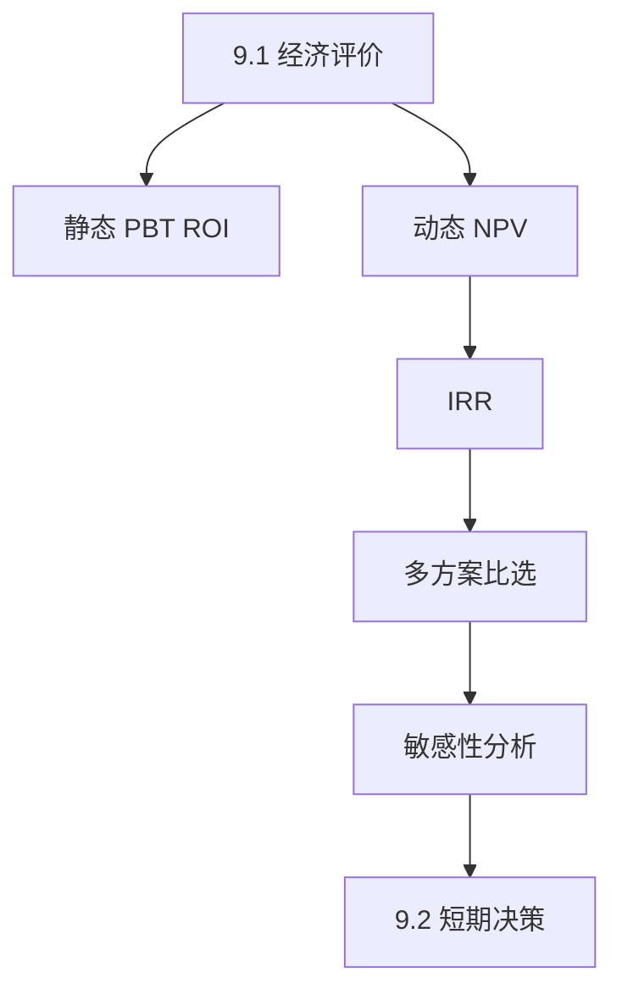

# 第9–10章 工程项目经济决策方法

> 课件：`9 10 工程项目经济决策方法.pdf` | 重要度：★★★ | 建议复习：4h  
> 前置：[08-工程经济决策基础.md](./08-工程经济决策基础.md)

## 本章考点一览

1. **必算**：静态投资回收期 PBT（插值法）；NPV 折现求和
2. **必会**：例5-1 甲/乙方案税后现金流 → PBT 与 NPV 比选
3. **必背**：NPV≥0 可行；互斥方案选 NPV 最大；IRR≥基准收益率可行
4. **必答**：PBT / NPV / IRR 各自优缺点对比
5. **了解**：敏感性分析答题框架；ROI 公式

---

## 本章在课程中的位置

- 第8章解决「如何算现金流、如何折现」；本章解决「**用哪个指标判断项目行不行、选哪个方案**」。
- 期末计算+综合应用高频。

## 知识脉络



---

## 知识点精讲

### 9.1 项目经济评价

#### 【定义】财务评价

从**企业**角度比较直接效益与直接费用，判断取舍，为投资决策依据；是可行性研究**核心**。

#### 【★★★】指标分类

| 分类方式 | 类型 |
|----------|------|
| 是否考虑时间价值 | **静态**（PBT、ROI） / **动态**（NPV、IRR）— 以动态为主 |
| 指标性质 | 价值型(NPV)、时间型(PBT)、比率型(ROI、IRR) |

**原则**：单指标片面，需多指标配合；动态法优于静态法做方案比选。

### 静态评价

#### 【★★★】静态投资回收期 PBT

**含义**：不考虑资金时间价值，累计净现金流量**首次为零**所需年数（从建设初年起）。

**判据**：Pt ≤ 行业基准 Pc → 可行。

**公式（各年净流量不等，最常用）**

```
Pt = (m − 1) + |上年累计净流量| / 第 m 年净流量
```

其中 m = 累计净流量**首次为正**的年份。

**等额年净流量特例**：Pt = I / A（I 为总投资，A 为年等额净收益）。

#### 【★★☆】PBT 优缺点

| 优点 | 局限 |
|------|------|
| 简单直观 | **未考虑时间价值** |
| 反映周转快慢 | 回收后现金流忽略 |
| | 营运资本、残值处理有争议 |
| | **不宜**多方案比选（如 A/B/C 都是2年回收但收益不同） |

#### 【★★☆】ROI 投资回报率

ROI = (年均净收益 / 总投资额) × 100%

优点：简单、可横向比单位投资盈利能力。  
局限：只看「年平均」，忽略时间分布；部门利益与整体利益可能冲突。

### 动态评价

#### 【★★★】净现值 NPV

```
NPV = Σ_{t=0}^{n} (CI_t − CO_t) / (1+i0)^t = Σ NCF_t / (1+i0)^t
```

- **i0**：基准收益率（MARR），应 ≥ 资金成本与机会成本较大者，并考虑风险贴水、通胀。  
- **判据**：NPV ≥ 0 可行；互斥且投资期相同时选 **NPV 最大且为正** 的方案。  
- **与 IRR 关系**：使 NPV=0 的折现率即为 IRR。

| 优点 | 局限 |
|------|------|
| 考虑时间价值与全寿命现金流 | 基准率难定 |
| 金额直观 | 不反映单位投资效率 |
| 优于 PBT 做方案比选 | 寿命不等需统一研究期 |

#### 【★★★】内部收益率 IRR

**定义**：使 NPV=0 的折现率。

**判据**：IRR ≥ 基准收益率 → 可行。

**求法（试算+插值）**  
1. 用 i=10% 算 NPV  
2. 若 NPV>0，提高 i；若 NPV<0，降低 i  
3. 找到 NPV1>0、NPV2<0 的两点（i1、i2 相差宜 <2%）  
4. 线性插值求 IRR  

**局限**：非常规现金流可能多解；与 NPV 结合判断更稳。

### 9.1.4–9.1.5 多方案与敏感性

- **互斥方案**：寿命相同 → 比 NPV；寿命不同 → 年值法、最小公倍数法等构造相同研究期。  
- **敏感性分析**：令价格、投资、产量等参数变动 ±x%，看 NPV/IRR 变化幅度 → 找**敏感因素**（风险来源）。

### 9.2 产品短期经济决策

- 本量利、边际贡献、短期定价、是否停产：抓住**固定成本已沉没、只比较边际贡献与可避免成本**。

---

## 公式专题

| 指标 | 公式 | 可行条件 |
|------|------|----------|
| 静态PBT | 见上插值 | Pt ≤ Pc |
| ROI | 年均净收益/总投资×100% | 与行业/企业比较 |
| NPV | Σ NCF_t/(1+i0)^t | NPV≥0 |
| IRR | NPV(i)=0 的 i | IRR≥i0 |
| 直线折旧 | (原值−残值)/n | 例5-1 税后现金流 |

### 指标选用逻辑

| 你想知道… | 优先指标 |
|-----------|----------|
| 多久回本（粗略） | PBT（但要知局限） |
| 项目赚多少钱（绝对值） | NPV |
| 项目收益率（相对） | IRR、ROI |
| 两个方案选谁 | **NPV**（同等条件） |

---

## 例题详解

### 例5-1：甲/乙设备投资比选（核心大题）

**题目要点**（课件）：所得税25%；直线折旧；乙方案有残值4000、流动资金3000、修理费逐年+400。

| 方案 | 投资 | 寿命 | 年收入 | 年成本 | 其他 |
|------|------|------|--------|--------|------|
| 甲 | 20000 | 5 | 9000 | 3000 | 无残值 |
| 乙 | 22000+流动资金3000 | 5 | 9500 | 3000起递增 | 残值4000 |

**解题总流程**

1. **列各年税后净现金流量**（考虑折旧抵税、所得税、流动资金回收）  
2. **算累计净流量** → **插值求 PBT**  
3. **给定 i0=10%** → 逐年折现 → **求 NPV**  
4. **结论**：甲 PBT 更短且 NPV 更优时选甲（课件：甲 PBT≈3.64年，乙≈4.32年）

#### 甲方案 PBT（课件结果）

| 年 | 0 | 1 | 2 | 3 | 4 | 5 |
|---|---|---|---|---|---|---|
| NCF | −20000 | 5500 | 5500 | 5500 | 5500 | 5500 |

累计：−20000 → −14500 → −9000 → −3500 → +2000 → …  
回收期在第4年：

```
PBT = 3 + 3500/(3500+2000) = 3 + 3500/5500 ≈ 3.64 年
```

#### 甲方案 NPV（i0=10%，课件）

| 年 | 0 | 1 | 2 | 3 | 4 | 5 |
| NCF | −20000 | 5500 | 5500 | 5500 | 5500 | 5500 |
| 折现系数 | 1 | 0.9091 | 0.8264 | 0.7513 | 0.6830 | 0.6209 |
| 现值 | −20000 | 5000.05 | 4545.20 | 4132.15 | 3756.50 | 3414.95 |

**NPV ≈ 848.85 万元**（课件数；单位以题目为准，复习按课堂）

**易错**  
- 折旧在现金流表中**加回**（非付现成本）但影响所得税。  
- 乙方案第0年现金流出含**流动资金垫支**，最后一期要**收回**。  
- 修理费递增要分年列入 CO。

**变式**：问「为何 PBT 相同的三项目不可比」→ 答收益规模、风险、回收后现金流不同，应看 NPV。

---

### 例5-2：IRR 试算（概念）

**已知**：0年−2000；1年300；2–4年500；5年1200（万元）；基准10%。  
**步骤概要**  
1. i=10% 时 NPV>0 → 提高 i 至12%再算  
2. 找到 NPV 由正变负的区间，插值得 IRR  
3. 若 IRR≥10% → 可行  

（具体数值以课件演算为准，掌握**试算+插值**流程即可。）

---

### 单选题陷阱：NPV 理解

**错误选项**：「净现值总是大于0」— 显然错，NPV 可正可负。  
**正确理解**：NPV 考虑时间价值；需给定折现率；不能单独给出资报酬率（那是 IRR 的优势/劣势表述）。

---

## 关键概念对比表

| 指标 | 时间价值 | 适合 |
|------|----------|------|
| PBT | 否 | 粗评、初选 |
| NPV | 是 | 比选、决策 |
| IRR | 是 | 相对收益、与基准比 |
| ROI | 否（年均） | 粗看盈利能力 |

---

## 敏感性分析（论述框架）

1. 选定关键参数（售价、产量、投资、经营成本）  
2. 设变动幅度（如 ±10%、±20%）  
3. 重算 NPV/IRR，列表或绘图  
4. 变化最大者 = **最敏感因素** = 风险管控重点  

---

## 本章小结

1. **先静态后动态**：PBT 算完必须再用 NPV 验证。  
2. **例5-1** 是模板题：税后现金流 → 累计 → PBT → 折现 → NPV。  
3. **NPV 与 IRR**：NPV 给绝对值，IRR 给回报率；基准率要合理。  
4. 答题写**判据句**：「因 NPV_A > NPV_B 且均>0，故选甲」。  

---

## 自测清单

- [ ] 手写 PBT 插值公式并套一组数  
- [ ] 说出 NPV、IRR 各 2 条优点 2 条局限  
- [ ] 列出例5-1 解题四步  
- [ ] 解释为何三个 PBT 都是2年的项目仍不同
