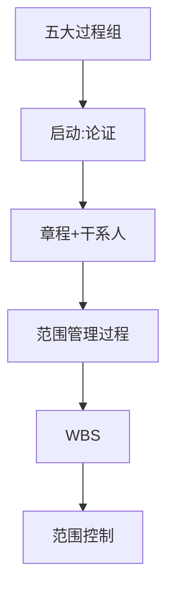

# 第12章 项目启动和范围管理

> 课件：`12 工程项目启动和范围管理（2学时）.pdf` | 重要度：★★☆–★★★ | 建议复习：2h  
> 对照：[课程整体要求.md](../课程整体要求.md)

## 本章考点一览

1. **必背**：范围管理核心——回答「**什么必须做**」，防范围蔓延
2. **必答**：项目论证 vs 项目章程 vs 启动会（各解决什么问题）
3. **必记**：项目章程主要内容包括哪些字段
4. **必做**：WBS 原则（100% 规则、可交付成果导向）
5. **论述**：范围蔓延原因与对策（章程+WBS+变更控制）

---

## 本章在课程中的位置

- 衔接第8章**经济论证**（论证结论可行才启动）与第11章**过程组**。
- 项目报告可对应：立项依据（论证）+ 范围说明书 + WBS 初稿。

## 知识脉络

---

## 知识点精讲

### 12.1 项目启动过程组

#### 【★★★】项目论证（可行性研究）

与第8章「项目论证」一致：市场、技术、经济、风险分析 → **可行/不可行**结论。  
**只有**论证表明条件可靠、技术先进、经济有合理利润，才应立项。

**【易错易混】**

| | 项目论证 | 项目章程 |
|---|----------|----------|
| 时点 | 启动**前** | 启动时正式批准 |
| 输出 | 可行性研究报告 | 授权文件 |
| 作用 | 决策是否做 | 授权项目经理开始做 |

#### 【★★★】制定项目章程

**作用**：正式承认项目存在；赋予 PM 动用资源的权力。

**主要内容（简答题逐条背）**

| 条目 | 含义 |
|------|------|
| 项目目的/批准原因 | 为什么要做 |
| 高层级需求与描述 | 做什么的大框 |
| 高层级风险 | 主要风险类别 |
| 总体里程碑进度 | 关键节点 |
| 总体预算 | 资金上限级 |
| 干系人清单 | 谁相关 |
| 可测量目标与成功标准 | 时间/范围/成本等 |
| 项目审批要求 | 谁判定成功、谁签字 |
| 委派 PM 及权责 | 谁负责执行 |
| 发起人签字 | 授权效力 |

#### 【★★☆】识别干系人

- 尽早识别所有影响项目或受项目影响的人/组织。  
- 输出：**干系人登记册**（姓名、角色、期望、影响力、分类：支持/中立/反对）。  
- 不同干系人期望可能冲突，PM 需制定参与策略。

#### 启动会

干系人见面，对齐目标与计划，建立沟通机制。

### 12.2–12.3 范围管理

#### 【★★★】核心理念

> 范围管理回答的是「**什么必须做**」，而不是「什么可以做」。

**范围蔓延（Scope Creep）**：未经控制的范围增加 → 工期延误、成本超支、质量下降。  
行业谚语：允许范围无控变化，其变化速度会超过你的想象。

#### 【★★★】范围管理主要过程

1. 规划范围管理  
2. 收集需求  
3. **定义范围**（范围说明书：产品范围、交付物、验收标准、除外责任）  
4. **创建 WBS**：把可交付成果分解到可管理的工作包  
5. **确认范围**：干系人正式验收可交付成果  
6. **控制范围**：监督变更，走变更控制流程  

#### 【★★★】WBS 原则

| 原则 | 说明 |
|------|------|
| **100% 规则** | WBS 各层之和 = 项目全部范围，不能漏也不能重 |
| 可交付成果导向 | 按「产出物」分，不是按部门分 |
| 互斥 | 一项工作只归一个包 |
| 可管理可估算 | 叶子节点可估工时/成本 |

**【通俗理解】**WBS 像「家谱」，最底层工作包交给具体人，汇总即全项目工作。

---

## 关键概念对比表

| | 产品范围 | 项目范围 |
|---|----------|----------|
| 关注 | 做什么功能/性能 | 为交付产品要做哪些工作 |

| | 范围说明书 | WBS |
|---|------------|-----|
| 内容 | 文字描述边界 | 树状分解结构 |

---

## 案例剖析：范围蔓延（论述 250 字）

**事实**：客户不断加「小改动」。  
**原因**：无基线、无变更评审、未评估对铁三角影响。  
**对策**  
1. 章程与范围说明书书面确认基线  
2. WBS 锁定工作包  
3. 变更须填请求→影响分析（时间/成本/质量）→CCB 审批  
4. 拒绝未批准工作  

**话术**：「范围控制不是拒绝变更，而是让变更**可见、可评估、可授权**。」

### 干系人登记册示例行（记结构）

| 姓名 | 角色 | 期望 | 影响力 | 分类 |
|------|------|------|--------|------|
| 张老师 | 发起人 | 按期验收 | 高 | 支持 |
| 用户代表 | 客户 | 功能完整 | 高 | 中立 |

---

## 本章小结

1. **论证→章程→启动会**三步逻辑别混。  
2. 章程字段建议背 **8 项以上**。  
3. **WBS + 100% 规则**是范围题必写。  
4. 范围蔓延题标准答案：**变更控制流程**。  

---

## 自测清单

- [ ] 列举章程至少 8 项内容  
- [ ] 解释 100% 规则  
- [ ] 写一段范围蔓延对策（≥150 字）
