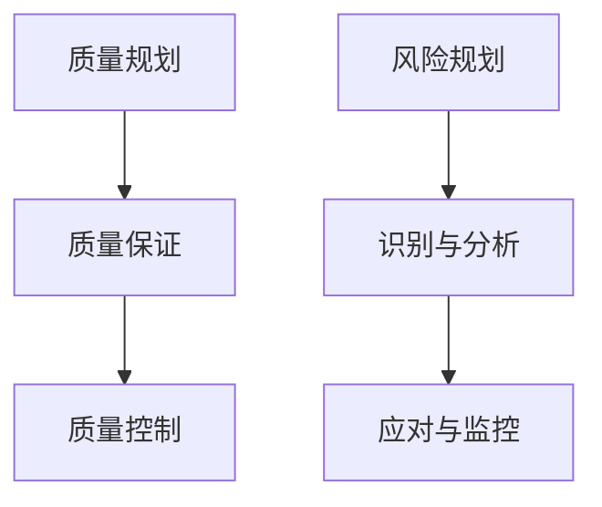

# 第15章 质量与风险管理

> 课件：`ppts/2026课程知识点总结.pdf` §14 + 教材第 13–14 章；**补充**：`工概/补充/质量控制工具说明.docx`、`工概/工程概论.docx`  
> 重要度：★★★ | 建议复习：2.5h | 润色：2026-06-11（含工概补充）

## 本章考点一览

1. **必背**：质量管理三过程；七种 QC 工具及适用场景
2. **必背**：风险六过程；消极/积极风险应对策略各四类
3. **必算**：决策树（表 13-13 型）；概率-影响矩阵定性分析
4. **必答**：项目风险特性；现代质量管理三阶段
5. **案例**：青藏铁路质量管理、迪拜棕榈岛风险、杜绝「豆腐渣」（思政）

## 本章缩写对照

| 缩写 | English | 中文 |
|------|---------|------|
| **QC** | Quality Control | 质量控制 |
| **TQM** | Total Quality Management | 全面质量管理 |
| **PDCA** | Plan-Do-Check-Act | 计划-执行-检查-处理 |
| **DMAIC** | Define-Measure-Analyze-Improve-Control | 六西格玛改进环 |
| **EMV** | Expected Monetary Value | 期望货币值 |
| **UCL / LCL** | Upper / Lower Control Limit | 控制上 / 下限 |

---

## 本章在课程中的位置

- 铁三角第四约束「质量」；与第4章伦理（公众安全）、第6章可持续衔接。
- 项目报告：至少 2 种 QC 工具 + 风险登记册（≥5 条，含高中低）。

## 知识脉络

---

## 知识点精讲

### 15.1 项目质量管理

#### 【★★☆】现代质量管理三阶段

传统质量检验 → 统计质量管理 → **全面质量管理 TQM**

#### 【★★☆】持续改进（`工概/工程概论.docx`）

- **PDCA（戴明环）**：Plan 计划 → Do 执行 → Check 检查评估 → Act 处理改进 → 再 Plan
- **六西格玛**：数据驱动、减少变异；目标约每百万机会 3.4 缺陷  
  **DMAIC**：Define 定义 → Measure 测量 → Analyze 分析 → Improve 改进 → Control 控制

#### 【★★★】三个过程

| 过程 | 作用 |
|------|------|
| 规划质量管理 | 确定质量标准与如何达到 |
| 实施质量保证 | 审计过程，确保用正确方法 |
| 控制质量 | 监测结果，纠偏 |

#### 【★★★】七种质量控制工具

**口诀：检因帕直控散流**（`工概/补充/质量控制工具说明`）

| 口诀 | 工具 | 适用问题 | 易混 |
|------|------|----------|------|
| **检** | 质量检查表 | 分类记录缺陷次数 | 先数清楚 |
| **因** | 因果图（鱼骨图） | 找根本原因 | **人机料法环测** 六类原因 |
| **帕** | 帕累托图 | 「关键的少数」、二八原则 | 抓主要矛盾 |
| **直** | 直方图 | **一组数据**的分布形态 | 看集中/偏移/双峰 |
| **控** | 控制图 | **过程**是否稳定受控 | 点超 UCL/LCL、连续同侧、趋势 |
| **散** | 散点图 | **两变量**是否相关 | 正相关/负相关/无相关 |
| **流** | 流程图 | 过程步骤与决策点 | 看哪环节易错、缺检查 |

**直方图 vs 控制图 vs 散点图**：直方图看分布；控制图看过程随时间是否失控；散点图看两因素关系。

### 15.2 项目风险管理

#### 【★★☆】项目风险特性

1. 项目固有，无法完全消除  
2. 不确定事件或条件  
3. 对范围、进度、成本、质量等目标有**正面或负面**影响  

#### 【★★☆】六个主要过程

规划风险管理 → 识别风险 → 定性分析 → 定量分析 → 规划应对 → 实施应对 → 监督风险

（教材常合并表述为六过程，含监控。）

#### 【★★★】应对策略（课件 / 2026 知识点总结用语）

| 类型 | 策略 | 备注 |
|------|------|------|
| **负面（威胁）** | 规避、**承担**、转移、**缓解**、上报 | PMI：减轻≈缓解，接受≈承担 |
| **积极（机会）** | **开发**、共享、**增强**、承担、上报 | PMI：开拓≈开发，提高≈增强 |

**风险值** = 概率 × 影响（定性矩阵）；**EMV** = Σ(概率 × 收益或损失)。

#### 【★★☆】定性分析

**概率-影响矩阵**：横轴影响、纵轴概率 → 划分高/中/低风险优先级。

#### 【★★★】决策树（定量）

从决策节点出发，各方案分支计算**期望货币值 EMV**，选 EMV 最大（或成本最小）方案。

---

## 例题：表 13-13 生产批量决策

各方案期望收益 = Σ(概率 × 收益)：

| 方案 | 计算 | EMV |
|------|------|-----|
| A 小批量 | 0.2×0.5 + 0.5×1.5 + 0.3×1.5 | **1.30 万** |
| B 中批量 | 0.2×0 + 0.5×2.0 + 0.3×2.5 | **1.75 万** |
| C 大批量 | 0.2×(−1) + 0.5×0 + 0.3×5.0 | **1.30 万** |

**结论**：选 **B（中批量）**，期望收益最高 1.75 万元。

---

## 本章小结

1. 质量是规划出来的，也是控制出来的——七种工具对应不同诊断问题。
2. 风险要登记、要分析、要有应对，不能只写「加强管理」。
3. 决策树期末可能作为小计算或案例分析。
4. 项目第四次提交含质量工具应用与风险登记册。

---

## 自测清单

- [ ] 列举七种 QC 工具各一句用途
- [ ] 写出消极/积极风险应对各四类
- [ ] 手算表 13-13 三方案 EMV 并选优
- [ ] 简述概率-影响矩阵怎么用
- [ ] 说明 TQM 三阶段

---

## 课后计算题（指南 14 题 · 本章 1 道）

> 解题思路详见 [工程概论课后习题.md](../工程概论课后习题.md) **附录 B.5**

| 题号 | 题型 | 先判型 | 参考答案要点 |
|------|------|--------|--------------|
| **13-11** | 决策树 EMV | 多方案×概率 | A=1.30；B=**1.75**；C=1.30 → **选 B** |

---

## 课后习题

> 详见 [工程概论课后习题.md](../工程概论课后习题.md) 第 13 章

1. 简述项目质量管理的重要性。
2. 项目质量管理的三个过程是什么？举例分析。
3. 简述质量、项目质量和现代质量管理。
4. 项目质量控制的常用工具有哪些？各自适用于解决什么问题？
5. 什么是项目风险？
6. 项目风险管理的基本概念是什么？
7. 项目风险管理涉及的六个主要过程是什么？
8. 如何进行风险识别？
9. 项目风险分析方法有哪些？
10. 简述如何用概率-影响矩阵对风险进行定性分析。
11. **（必算）** 表 13-13 决策树选方案。
12. 项目积极风险和消极风险的应对策略有哪些？
13. IT 项目高风险成功/失败案例对比分析。

**大纲指定**：重算教材「决策树分析案例」；教材第 13 章习题 11。
