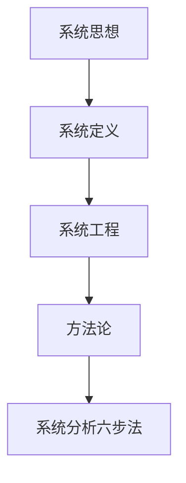
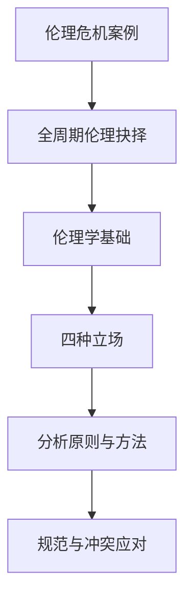
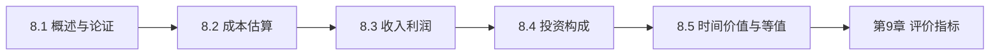
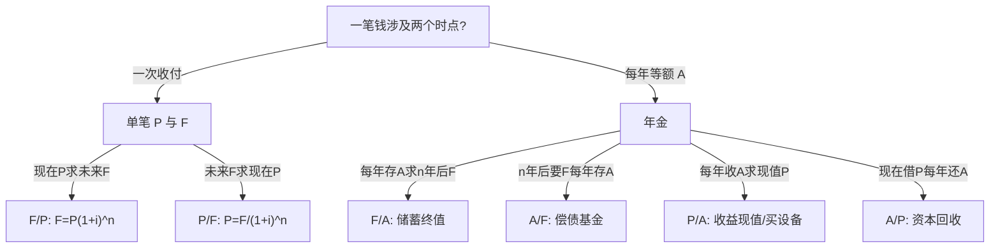
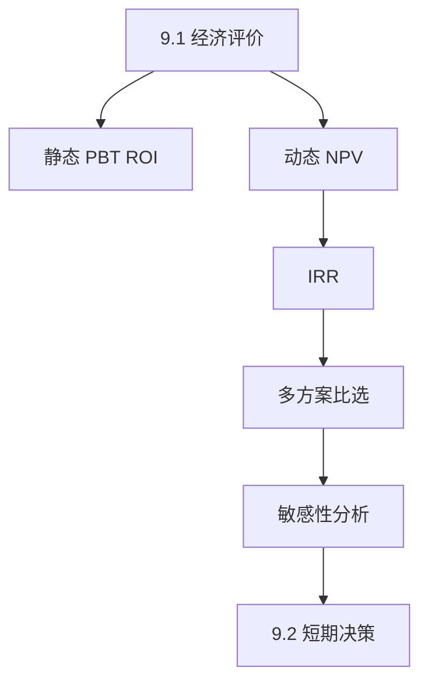
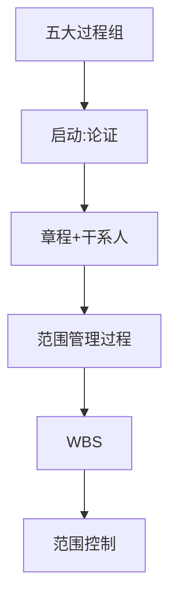

# 工程概论 完整笔记

> 由 `notes/` 分章笔记自动合并 | 维护：只改分章文件后运行 `python notes/merge_notes.py`  
> 课程总纲：[课程整体要求.md](./课程整体要求.md)

**图例**：★★★ 必考深掌握 | ★★☆ 理解会应用 | ★☆☆ 了解识记

---

## 目录

- [一、课程整体要求（摘要）](#一课程整体要求摘要)
- [二、第0–1章 绪论与工程认识](#第01章-绪论与工程认识)
- [三、第3章 系统分析](#第3章-系统分析)
- [四、第4章 工程与伦理](#第4章-工程与伦理)
- [五、第5章 工程与法律法规](#第5章-工程与法律法规)
- [六、第6–7章 标准化与可持续发展](#第67章-工程与标准化可持续发展)
- [七、第8章 工程经济决策基础](#第8章-工程项目经济决策基础)
- [八、第9–10章 工程经济决策方法](#第910章-工程项目经济决策方法)
- [九、第11章 项目管理概述](#第11章-项目管理概述)
- [十、第12章 项目启动和范围管理](#第12章-项目启动和范围管理)
- [附录：全课程自测总表](#附录全课程自测总表)

---

## 一、课程整体要求（摘要）

| 项目 | 权重 | 说明 |
|------|------|------|
| 平时 | 20% | 课堂互动、作业、测验 |
| 项目报告 | 20% | 方案+非技术因素+经济+管理文档+答辩 |
| 期末 | 60% | 基础约60% + 综合约40% |

**复习优先级**：① 第8–10章经济（必算） ② 伦理/管理/法律/可持续 ③ 绪论七阶段+系统思维 ④ 平时作业

详见 [课程整体要求.md](./课程整体要求.md)。

---

## 第0–1章 绪论与工程认识

> 课件：`工程概论 I 01——绪论与工程认识1.pdf` | 重要度：★★☆ | 建议复习：1.5h  
> 对照：[课程整体要求.md](./课程整体要求.md)

## 本章考点一览

1. **必背**：复杂工程问题的三条能力标准（技术+非技术、全周期、经济回报可能）
2. **必背**：产品开发**全周期七阶段**及每阶段核心任务（概念→生命周期）
3. **必记**：传统开发 vs 全周期/IPD 开发的区别（为何多次返工）
4. **必答**：课程六条目标各自解决什么问题（尤其目标4非技术约束、目标5经济、目标6管理）
5. **了解**：科学 / 技术 / 工程三者关系；考核 20+20+60

---

## 本章在课程中的位置

- 全课**总纲**：后面系统分析、伦理、法律、经济、管理都在「复杂工程问题 + 全周期开发」框架下展开。
- 项目报告要求：方案设计 + 非技术因素 + 经济可行性 + 管理文档——绪论里的七阶段表可直接当报告结构 checklist。

## 知识脉络


---

## 知识点精讲

### 0 绪论：为何学、学什么、如何学

#### 【定义】复杂工程问题

能将**专业技术**与**非技术工程基础**融合，设计出满足社会需求、符合内外部约束、面向实际应用且**具有经济回报可能**的解决方案；并掌握**全周期、全流程**产品设计/开发方法。

#### 【通俗理解】

- 只会写代码/画图不够，还要会算钱、懂法规、顾伦理、管项目。
- 「复杂」体现在：多约束、多利益方、长周期、不确定性。

#### 【★★★】三条标准（简答题常用）

| 序号 | 内容 | 答题关键词 |
|------|------|------------|
| 1 | 技术+非技术融合，方案可行且有经济回报可能 | 约束、经济回报 |
| 2 | 了解全周期、全流程开发方法 | IPD、七阶段 |
| 3 | 多数领域「复杂工程问题」≈ 产品开发能力 | 产品全生命周期 |

#### 【★★☆】传统 vs 现代产品开发

| 对比项 | 传统模式 | 全周期模式 |
|--------|----------|------------|
| 中心 | 以技术为中心 | 市场+经济+可制造性等 |
| 流程 | 研发→中试→…线性，接口少 | 七阶段闭环，早期并行考虑 |
| 问题 | 后期才发现不可制造/无市场 → **多次返工** | 概念/计划阶段做经济决策与冲突消解 |

#### 【★★★】全周期七阶段任务表

| 阶段 | 核心任务 | 非技术关注点 |
|------|----------|--------------|
| **概念** | 产品策划、产品定义 | 市场相容、各种冲突因素 |
| **计划** | 总体方案设计 | **全流程经济决策**、是否值得开发 |
| **开发** | 设计实现 | 可生产性、可安装性、可维护性、可靠性 |
| **验证** | 系统测试 | 是否满足预期；极端环境风险 |
| **发布** | 确认需求与冲突已解决 | 小概率极端风险可控，可投放市场 |
| **生命周期** | 量产、运维 | 根据经济回报决定终止/迭代 |

**重要度依据**：课程目标2、项目报告结构；期末论述常考「某阶段应做什么」。

### 1 工程与工程师

#### 【定义】

- **工程**：有组织地运用科学知识、技术与资源，改造自然、建造系统、交付产品/服务以满足人类需求。
- **工程师**：应用科学与工程知识解决实际问题、对公众安全与福祉负责的专业人员。

#### 【易错易混】科学 vs 技术 vs 工程

| | 科学 | 技术 | 工程 |
|---|------|------|------|
| 目标 | 认识世界（发现规律） | 应用科学（怎么做） | 集成实现（做成系统/产品） |
| 产出 | 理论、知识 | 方法、工艺、工具 | 可运行的工程系统 |
| 例子 | 力学定律 | 焊接工艺 | 一座桥、一款手机 |

### 课程六目标（与后文章节映射）

| 目标 | 要点 | 对应章节 |
|------|------|----------|
| 1 | 人才素质；**非技术指标**地位 | 全课 |
| 2 | 工程定义；全周期开发 | 本章 |
| 3 | 系统思维与方法 | 第3章 |
| 4 | 法规、伦理、规范、管理、经济约束 | 4、5、6、8–12章 |
| 5 | 经济可行性分析 | 第8、9章 |
| 6 | 项目管理与团队协作 | 第11、12章 |

---

## 关键概念对比表

| 概念 | 一句话 | 考试怎么用 |
|------|--------|------------|
| 复杂工程问题 | 技术+非技术+全周期+能赚钱 | 三条展开写 |
| 全周期 | 从创意到回收 | 按七阶段答 |
| 非技术指标 | 伦理、法律、标准、经济、管理 | 项目报告必写一块 |

---

## 案例剖析：为何「总收益相同」仍要选方案 A（预习 8.5）

**事实**：两项目 3 年总收益都是 3000 元，但现金流年份不同。  
**考点**：预告**资金时间价值**——钱越早到手越值钱，不能直接把各年数字相加。  
**答题话术**：「需绘制现金流量图并折现到同一时点比较，不能仅比较收益总和。」

---

## 本章小结

1. 本课培养的是能搞定**复杂工程问题**的工程师，不是只会单一技术。
2. **七阶段**是全书主线，计划阶段的经济决策连接第8章。
3. 非技术约束（伦理、法、标准、管理）与第4–6、11–12章一一对应。
4. 考核：**20% 平时 + 20% 项目 + 60% 期末**（以绪论课件为准）。
5. 复习时先背熟七阶段表 + 复杂工程问题三条，再进分章。

---

## 自测清单

- [ ] 不看书写出七阶段名称及每阶段 1 句核心任务
- [ ] 用 3 句话解释「复杂工程问题」
- [ ] 对比传统开发与全周期开发各写 2 点
- [ ] 说出课程目标 4、5、6 分别对应哪几章
---

## 第3章 系统分析

> 课件：`工程概论 I 03——系统分析.pdf` | 重要度：★★☆ | 建议复习：1.5h  
> 对照：[课程整体要求.md](./课程整体要求.md)

## 本章考点一览

1. **必背**：系统思想核心——整体大于部分之和；系统分析六步法
2. **必答**：丁谓修宫案例（问题拆解→一体化方案→一举三役）
3. **必记**：系统 vs 系统工程 vs 系统分析的区别
4. **了解**：霍尔三维结构、软系统（切克兰德）各解决什么类问题
5. **联系项目**：用系统思维写「方案对全局的影响」

---

## 本章在课程中的位置

- 落实课程目标3：复杂工程问题要用**系统思维**看相互制约关系，而不是只优化局部。
- 与绪论「全周期」互补：全周期管时间维度，系统分析管**要素关联**维度。

## 知识脉络



---

## 知识点精讲

### 3.1 系统思想与系统思维

#### 【定义】

**系统**：由相互联系、相互依赖、相互制约、相互作用的要素构成的**有机整体**（辩证唯物主义：物质世界普遍联系）。

**系统思维**：从整体上考虑问题，关注要素之间关系，而非孤立优化局部。

#### 【通俗理解】

- 修宫殿不只是「盖房子」，还牵涉取土、运输、垃圾处理——拆开看是三个麻烦，合起来设计可以**一个方案解决三个问题**。
- 大工程（三峡、阿波罗）都是「技术+社会+经济+环境」多目标系统。

#### 【★★★】丁谓修宫——五步答题模板

| 步骤 | 内容 |
|------|------|
| 1 原问题 | 修宫需大量土石建材，旱道运输成本高、工期紧 |
| 2 子问题 | ①取土 ②运材 ③清废墟 |
| 3 系统方案 | 挖沟取土烧砖 → 沟注水运材 → 完工填沟处理垃圾 |
| 4 效果 | 「一举而三役济」（《梦溪笔谈》） |
| 5 考点 | **整体优化**优于局部最优 |

**重要度依据**：课件经典案例，简答/论述高频。

#### 【★☆☆】大系统案例

- **阿波罗计划**：多机构协作、技术与管理集成。
- **三峡工程**：防洪、发电、航运、移民、生态等多目标权衡。

### 3.2 系统与系统工程

#### 【定义】系统工程

运用**系统观点**和**定量/定性方法**，对大型复杂工程进行规划、设计、实施与运行的组织管理活动，追求**整体最优**而非局部最优。

#### 【易错易混】

| 术语 | 侧重点 |
|------|--------|
| 系统思想 | 哲学/思维层面：整体观 |
| 系统工程 | 实践层面：组织与管理大型工程 |
| 系统分析 | 方法层面：问题→方案→评价→决策 |

#### 【★★☆】系统观演化（了解）

古代朴素整体观 → 近代分析还原（只见树木）→ 现代科学系统观（见树又见林，定性与定量结合）。钱学森：系统思想在哲学、运筹学、系统工程中各有表达形式。

### 3.3–3.4 方法论与系统分析

#### 【★★★】系统分析一般步骤

1. **明确问题**（目标、边界、约束）  
2. **确定目标**（可度量）  
3. **提出备选方案**  
4. **建立模型**（数学、仿真、逻辑）  
5. **评价方案**（技术、经济、社会、环境）  
6. **决策与实施**（选优、反馈）

#### 【★★☆】常用方法论（一句话）

| 方法 | 适用 |
|------|------|
| 霍尔三维结构 | 硬系统、结构清晰：时间×逻辑×知识维 |
| 切克兰德软系统 | 目标不清、人的因素多：学习→根定义→比较 |
| 并行工程 | 设计/工艺/供应链早期并行，缩短周期 |

---

## 关键概念对比表

| | 还原论 | 系统论 |
|---|--------|--------|
| 视角 | 分解、局部 | 关联、整体 |
| 风险 | 局部最优≠整体最优 | 需协调多目标 |
| 工程例 | 只优化零件成本 | 同时看供应链、维护、报废 |

---

## 案例剖析：丁谓修宫（论述题 200 字版）

**事实→考点→话术**  
- 事实：三个独立难题（土、运、垃圾）。  
- 考点：系统优化、接口设计。  
- 话术：「将取土、水运、填沟串联为同一空间链路，降低运输与处置成本，体现系统思维下多目标协同，而非分项逐个解决。」

---

## 本章小结

1. **系统思维** = 看关系、看整体、看多目标。  
2. **丁谓修宫**是必背简答素材。  
3. **系统分析六步法**可套进项目报告「方案比选」一节。  
4. 系统工程 ≠ 单纯项目管理，更强调技术与组织集成。  
5. 与第8章经济评价结合：方案评价要同时有技术模型与经济指标。

---

## 自测清单

- [ ] 默写系统分析六步法  
- [ ] 2 分钟内讲清丁谓修宫系统方案  
- [ ] 区分系统思想、系统工程、系统分析各 1 句
---

## 第4章 工程与伦理

> 课件：`4 工程与伦理 .pdf` | 重要度：★★★ | 建议复习：2h  
> 对照：[课程整体要求.md](./课程整体要求.md)

## 本章考点一览

1. **必背**：《工程伦理守则》生命至上——公众安全、健康、福祉、生态优先
2. **必答**：四种伦理立场（功利、义务、美德、权利）及适用情境
3. **必背案例**：挑战者号——技术、决策、组织、公正四维分析
4. **必答**：伦理在全周期各阶段（概念→生命周期）的抉择点
5. **了解**：伦理 vs 道德；工程师利益/角色/价值冲突应对

---

## 本章在课程中的位置

- 期末论述、项目报告**非技术因素**核心章。
- 与第5章法律（底线）、第6章可持续（环境责任）形成「责任三角」。

## 知识脉络



---

## 知识点精讲

### 4.1 工程伦理概述

#### 【定义】

- **伦理**：处理人与人、人与社会、人与自然关系应遵循的规则（偏社会、客观、普遍）。
- **道德**：个人内在的善恶标准与德性（偏主观、情境）。
- **工程伦理学**：研究工程中道德问题，对工程行为作道德论证的学科。

#### 【★★★】生命至上（答题首句）

《中国工程师联合体工程伦理守则》第一条：**把公众的安全、健康和福祉以及生态环境保护放在首位。**

IEEE 亦强调：工程不仅是技术问题，更是道德问题。

#### 【★★☆】工程伦理规范特征

| 特征 | 含义 |
|------|------|
| 禁止性 | 不得损害公众安全等底线 |
| 预防性 | 事前识别风险、前瞻分析后果 |
| 激励性 | 树立职业理想与榜样 |

### 4.2–4.3 伦理立场与分析

#### 【★★★】四种伦理立场对比表

| 立场 | 核心问题 | 判断标准 | 优点 | 局限 | 典型题 |
|------|----------|----------|------|------|--------|
| **功利论** | 什么后果最好？ | 最大多数人最大幸福；成本效益 | 便于量化比较方案 | 可能牺牲少数人 | 是否值得为千人实验牺牲百人？ |
| **义务论** | 什么行为正当？ | 可普遍化准则；人作为目的 | 保护权利与尊严 | 僵化、难处理冲突义务 | 能否撒谎保护他人？ |
| **美德论** | 什么样的人？ | 诚信、勇敢、负责任 | 塑造职业文化 | 标准因文化而异 | 工程师应具备何种品格？ |
| **权利论** | 权利是否被侵犯？ | 基本人权不可权衡 | 保护弱势群体 | 权利冲突时难决 | 知情权 vs 保密 |

#### 【通俗理解】考试怎么选立场

- 算总收益、比方案 → 先写**功利论**框架，再补义务论「是否侵犯基本权利」。
- 涉及隐瞒信息、强制实验 → 优先**义务论/权利论**批判。

### 4.4 全周期中的伦理

| 阶段 | 伦理抉择举例 |
|------|--------------|
| 概念 | 目标是否损害公众？市场 vs 安全 |
| 计划 | 经济决策是否忽视安全冗余 |
| 开发 | 可维护性、可靠性是否偷工减料 |
| 验证 | 极端测试是否充分 |
| 发布 | 已知缺陷是否隐瞒上市 |
| 生命周期 | 报废、污染、数据隐私 |

### 4.5 工程师规范与冲突

- **利益冲突**：个人经济利益 vs 雇主 vs 公众  
- **角色冲突**：技术专家 vs 管理者 vs 代言人  
- **价值观冲突**：效率 vs 公平 vs 环保  

**应对**：披露冲突、寻求第三方审查、拒绝违法违规指令、记录并报告安全隐患（结合挑战者号）。

---

## 关键概念对比表

| | 法律 | 伦理 |
|---|------|------|
| 约束力 | 国家强制 | 职业规范+内心自律 |
| 底线 | 不得违法 | 不得漠视公众安全 |
| 案例 | 进网许可 | 挑战者号发射决策 |

---

## 案例剖析：挑战者号（论述题模板）

### 事实摘要

- 1986年1月28日发射，73秒后解体，7名航天员遇难。  
- 直接技术原因：右侧固体火箭**O型环**在低温下密封失效，不稳定气流加剧泄漏。

### 分维度分析（课件要点）

| 维度 | 问题 | 答题句 |
|------|------|--------|
| **生产安全** | O型环设计未考虑极低温使用极限 | 技术预见不足，未留安全裕度 |
| **公共安全** | 已知风险仍发射；残骸可能二次伤害 | 将风险转嫁给公众 |
| **社会公正** | 公众知情权不足；信息不透明 | 违背知情同意原则 |
| **职业精神** | 工程师警告被管理层忽视；无发射逃生系统 | 未坚持「安全否决权」 |

### 答题结构（建议 300 字）

1. **立场**：违背生命至上与预防性伦理。  
2. **技术链**：密封失效→解体。  
3. **组织链**：压力赶工期→忽视 dissent。  
4. **规范链**：应暂停发射、完善应急。  
5. **启示**：工程师对公众负有**优先于雇主**的道德责任。

### 变式

- 若问「用功利论辩护发射」→ 指出短期政治收益 vs 长期生命损失，功利计算亦失败。  
- 若问「义务论」→ 不能将航天员仅作手段。

---

## 本章小结

1. 开篇先写**生命至上**。  
2. **四立场表**背熟，论述题先定性再选立场。  
3. **挑战者号**四维模板可套其他事故（福岛、波音787质量等）。  
4. 伦理嵌入**七阶段**，别只写「要重视伦理」一句空话。  

---

## 自测清单

- [ ] 默写四伦理立场各 1 句核心  
- [ ] 5 分钟写完挑战者号四维分析  
- [ ] 列举全周期 3 个伦理风险点
---

## 第5章 工程与法律法规

> 课件：`5 工程与法律法规 .pdf` | 重要度：★★☆ | 建议复习：1.5h  
> 对照：[课程整体要求.md](./课程整体要求.md)

## 本章考点一览

1. **必背**：法律效力层级（宪法＞法律＞行政法规＞地方性法规＞规章）
2. **必答**：工程活动须在法律框架内；合规先于技术可行
3. **案例**：手机进网许可（法规依据 + 标志三行含义）
4. **案例**：青蒿素专利（原创 vs 国际市场、专利许可）
5. **了解**：知识产权类型；产品责任与开发阶段关系

---

## 本章在课程中的位置

- 课程目标4「法规约束」的展开；项目报告**非技术因素**必写块之一。
- 与第6章「标准」配合：法是**底线**，标准是**技术要求**。

## 知识脉络


---

## 知识点精讲

### 5.1 法律基础知识

#### 【定义】

- **法**：通过规范人的行为调整社会关系，以实现正义秩序（人权保障为目标）。
- **法律**：有立法权的机关依程序制定的规范性文件。
- **法规**：行政法规、地方性法规等。
- **规章**：行政机关依程序发布的具有普遍约束力的文件。

#### 【★★★】效力等级（必背顺序）

```
宪法（最高）
  ↓
法律
  ↓
行政法规
  ↓
地方性法规
  ↓
规章（部门规章、地方政府规章；彼此可能交叉，不宜简单比高低）
```

**【通俗理解】**下位不得与上位抵触；工程立项要查**行业行政法规 + 国标/行标**是否同时满足。

#### 【★★★】工程与法

> 任何工程活动都必须在法律框架内进行，**合规性是技术可行性的前提**。（课件开篇）

### 5.2 知识产权

#### 【定义】

对智力成果享有的专有权利，常见：**专利、商标、著作权、商业秘密**。

#### 【易错易混】

| 类型 | 保护对象 | 工程场景 |
|------|----------|----------|
| 专利 | 技术方案 | 产品核心算法、结构 |
| 商标 | 标识 | 品牌、App 图标 |
| 著作权 | 表达形式 | 文档、代码（需注意职务作品归属） |
| 商业秘密 | 未公开信息 | 工艺参数、客户名单 |

工程师义务：不侵犯他人 IP；保护本单位成果；合同明确归属与许可。

### 5.3 产品开发与法律责任

- **产品质量责任**：缺陷致损→赔偿（无过错/Product liability 视法系而定，答题按课件）。
- **合同责任**：不按约定交付→违约。
- **侵权责任**：侵害他人权益。
- 设计阶段选型错误、制造阶段工艺失控、销售阶段隐瞒缺陷——责任主体与举证可能不同。

---

## 关键概念对比表

| | 法律 | 标准（第6章） |
|---|------|----------------|
| 性质 | 国家强制力 | 常自愿（GB 强制除外） |
| 违反后果 | 违法责任 | 不合格、无法入网/上市 |
| 例 | 电信条例 | GB/T 检测方法 |

---

## 案例剖析

### 案例1：手机进网许可证

**事实**  
- 每款手机上市前须取得进网许可（有效期 3 年）；标志含三行信息。

**考点**  
- 《电信条例》+《电信设备进网管理办法》  
- 许可 = 合法销售凭证；可官网查 21 位编码验真

**答题话术（简答）**  
「进网许可是国家对无线电通信设备市场准入的行政许可；标志第二行为型号，第三行为唯一编码，体现工程产品须满足法定准入条件后方可上市。」

### 案例2：青蒿素与专利

**事实**  
- 中国科学家发现青蒿素；复方蒿甲醚与诺华许可协议，国际销售权在诺华。

**考点**  
- **专利布局**与**国际化**决定产业利益；科研突破 ≠ 市场主导

**答题话术**  
「说明工程师除研发外须重视知识产权战略与许可谈判，否则可能造成巨大经济损失（课件：年损失估十几亿美元量级）。」

---

## 本章小结

1. 先**合法**再谈**先进**。  
2. 效力金字塔 + 两个案例（进网、青蒿素）是简答主力。  
3. IP 写项目报告时要有「谁拥有、是否侵权、如何许可」。  
4. 法与标准、伦理并列，构成非技术约束三角。  

---

## 自测清单

- [ ] 默写法律效力从高到低 4 级  
- [ ] 说清进网标志三行各表示什么  
- [ ] 用 3 句话说明青蒿素案例的工程启示
---

## 第6–7章 工程与标准化、可持续发展

> 课件：`6.7 工程与标准化、可持续发展.pdf` | 重要度：标准化 ★★☆ / 可持续 ★★★ | 建议复习：2h  
> 对照：[课程整体要求.md](./课程整体要求.md)

## 本章考点一览

1. **必背**：GB（强制）与 GB/T（推荐）区别；标准是全周期市场准入前提
2. **必答**：标准 vs 技术法规（WTO：法规强制、标准自愿）
3. **必记**：标准化定义；标准在全周期各阶段的作用
4. **必答**：可持续发展内涵；工程师环境责任
5. **了解**：LCA 四步框架（目标与范围→清单→影响评价→解释）

---

## 本章在课程中的位置

- 目标4「行业规范」：标准是产品能否上市、互操作的**技术门槛**。
- 目标4「环境约束」：可持续与绿色工程是项目报告非技术分析常见块。

## 知识脉络


---

## 知识点精讲

### 6 工程与标准化

#### 【定义】标准（GB/T 20000.1 / ISO）

经公认机构批准的文件，规定**通用或重复使用**的规则、特性或指南，基于科学、技术与经验，促进最佳公共利益。

**标准化**：制定、发布、实施标准的活动。

#### 【通俗理解】

- 「没有规矩，不成方圆」——子弹卡壳、过山车轨道差 3mm、电压不匹配，都是**未按标准**的代价。
- 比尔·盖茨：标准化使软硬件资源共享成为现实。

#### 【★★★】标准与产品开发

**产品满足标准是进入市场的前提**（课件强调）。在全周期中：

| 阶段 | 标准作用举例 |
|------|--------------|
| 概念/计划 | 行业标准、安全规范可行性 |
| 开发 | 设计规范、材料标准 |
| 验证 | 测试方法标准（GB/T） |
| 发布/生命周期 | 认证、环保排放标准 |

#### 【★★☆】标准分类

| 维度 | 类型 | 代号/例 |
|------|------|---------|
| 强制力 | 强制性国家标准 | GB |
| 强制力 | 推荐性国家标准 | GB/T |
| 层级 | 国际 ISO/IEC、国家、行业、地方、企业 | |
| WTO | 技术法规（强制） | 如网络安全法要求 |
| WTO | 标准（自愿） | GB/T 8756 等 |

#### 【易错易混】

| 概念 | 区别 |
|------|------|
| 标准 vs 规范 | 常混用；规范可指技术规范文件，标准是最基本形式 |
| 标准 vs 法律 | 法管行为与责任；标准管技术一致性；部分 GB 具有法律效力 |

### 7 工程与可持续发展

#### 【定义】

既满足当代需要，又**不损害后代**满足其需要能力的发展模式；要求经济、社会、环境协调。

#### 【★★★】工程师责任

- 资源节约、污染预防、生态恢复  
- **绿色工程**：从源头减量、清洁生产、循环利用  
- **循环经济**：减量化、再利用、资源化  

#### 【★★☆】生命周期评价 LCA（答题框架）

| 步骤 | 内容 |
|------|------|
| 1 目标与范围 | 评什么产品、边界、功能单位 |
| 2 清单分析 | 各阶段资源消耗与排放数据 |
| 3 影响评价 | 碳足迹、酸化、毒性等归类 |
| 4 解释 | 结论、敏感性、改进建议 |

**【通俗理解】**LCA 回答「从摇篮到坟墓」环境影响有多大，用于比选材料或工艺。

---

## 关键概念对比表

| | GB | GB/T | 技术法规 |
|---|-----|------|----------|
| 性质 | 可强制 | 推荐 | 强制 |
| 违反 | 不得生产/销售 | 竞争力/认证 | 法律责任 |
| 例 | 安全限值 | 测试方法 | 进网、RoHS 类指令 |

---

## 案例剖析：标准失效的后果（课件幽默案例）

**事实**：子弹未按标准生产卡壳、双人伞、电压 120V 差异等。  
**考点**：标准不是「可有可无的文档」，而是**安全与互操作**保障。  
**话术**：「说明标准化是风险控制手段，贯穿设计—制造—检验全链条。」

---

## 本章小结

1. **GB vs GB/T** 必背；进网、RoHS 等是「法规+标准」组合。  
2. 标准在全周期**每个阶段**都要对表检查。  
3. 可持续答题抓：**代际公平 + 绿色/循环 + LCA 四步**。  
4. 与伦理章「环境伦理」、法律章「环保法规」一起写项目非技术章节。  

---

## 自测清单

- [ ] 解释 GB 与 GB/T  
- [ ] 写出 LCA 四个步骤名称  
- [ ] 说明标准在「验证阶段」的作用
---

## 第8章 工程项目经济决策基础

> 课件：`8 工程项目经济决策基础.pdf` | 重要度：★★★ | 建议复习：4–5h  
> 对照：[课程整体要求.md](./课程整体要求.md) | 范围：8.1–8.5

## 本章考点一览

1. **必算**：现金流量图、净现金流量表；复利终值、年金六系数查表
2. **必背**：沉没成本 vs 机会成本；生产要素法总成本构成
3. **必算**：完全成本法 / 变动成本法利润表（课件两例数字）
4. **必答**：项目论证含义与作用；资金时间价值「不能跨年直接相加」
5. **了解**：软件 FP/CoCoMo 组织型估算（例 2-5）

---

## 本章在课程中的位置

- 期末**计算题主战场之一**；为第9章 NPV、PBT、IRR 提供现金流与折现基础。
- 逻辑链：**为什么要论证 → 花多少钱(成本) → 赚多少钱(收入利润) → 投多少钱 → 钱的时间价值(等值换算)**。

## 知识脉络



---

## 知识点精讲

### 8.1 工程经济决策概述

#### 【定义】

在项目早期从**经济角度**评价技术方案；实施中**成本控制**；避免投资失误。

#### 【★★★】项目论证

对拟建项目从市场预测起，研究规模、工艺、厂址、投资、成本、风险等，评价必要性、先进性、**经济性、盈利性**，给出可行/不可行结论的**技术经济研究活动**。

**作用（简答五条）**：立项依据；筹资/贷款依据；计划设计采购依据；防风险提效率；申请启动依据。

#### 【★★★】工程经济分析

- 原则：资金时间价值、现金流量、多方案优选、风险收益权衡、定性定量结合。
- 内容：经济要素、时间价值、效果评价、方案选择、不确定性（敏感/风险/盈亏）。

### 8.2 成本与成本估算

#### 【★★★】成本

- **狭义**：生产成本（直接材料、直接人工、制造费用）。
- **广义**：为获取利益的一切代价。
- 工程经济中成本是**最重要指标之一**。

#### 【易错易混】

| 概念 | 含义 | 决策时 |
|------|------|--------|
| **沉没成本** | 已发生、与当前决策无关 | **不考虑** |
| **机会成本** | 资源用于本项目放弃的**最大**其他收益 | 应纳入权衡 |
| **变动成本** | 随产量变化 | 短期决策、本量利 |
| **固定成本** | 不随产量变化 | 分摊、保本分析 |

#### 【★★★】生产要素法（非软件工程）

```
总成本费用 = 外购原材料 + 外购燃料动力 + 工资及福利
           + 修理费 + 折旧费 + 摊销费 + 利息支出 + 其他费用
```

- 原材料 = 年产量 × 单位耗用量 × 单价  
- 工资 = 职工数 × 年人均工资；福利常按工资比例  

#### 【★★★】折旧（直线法最常考）

- 折旧额 = (原值 − 残值) / 使用年限  
- 年折旧率 = (1 − 净残值率) / 折旧年限 × 100%  
- 年折旧额 = 年折旧率 × 原值  

另有：工作量法、双倍余额递减法、年数总和法（加速折旧，期末净值勿忘残值）。

#### 【★★☆】软件成本链

规模(LOC/FP) → 工作量(人月) → 人工支出 → 总投资。  
**CoCoMo 组织型**：MM = 2.4×(KDSI)^1.05，TDEV = 2.5×(MM)^0.38。

### 8.3 营业收入、税金及附加、利润

#### 【定义】

经济分析中的「收入」通常指**营业收入** = 单价 × 销量（狭义）。

#### 【★★★】利润层次

1. **营业利润**（完全成本法）  
   = 营业收入 − 生产成本 − 营业税金及附加 − 销售/管理/财务费用 − 资产减值 ± 其他业务  
2. **利润总额** = 营业利润 + 营业外收入 − 营业外支出  
   或（课件另一式）= 营业收入 − 营业税金及附加 − **总成本费用**  
3. **净利润** = 利润总额 − 所得税（课件例：税率 25%）

#### 【★★★】变动成本法

- **边际贡献** = 营业收入 − 变动成本  
- **营业利润** = 边际贡献 − 全部固定成本  

**【易错】**同一业务用两种方法，营业利润数字可能不同（固定制造费用归属不同），但**边际贡献**一致。

### 8.4 投资

#### 【★★★】项目总投资（形成资产法）

固定资产投资 + 无形资产 + 其他资产（开办费）+ 流动资产投资。

固定资产投资包括：设备购置、建安、工程建设其他费、预备费、调节税、**建设期利息**。

### 8.5 资金的时间价值及等值计算

#### 【★★★】核心直觉

- 同样 13000 元总收益，**早收到**的方案更好（项目 A：6000+4000+3000 vs B：3000+4000+6000）。
- 10+10+20+30+40=110 **不能**直接与投资 100 比，必须折现到同一时点。

#### 【★★★】现金流量

- **CI** 流入，**CO** 流出，**NCF = CI − CO**  
- 图规则：时间轴向右；**向上**为正（收入、借入）；**向下**为负（投资、支出）

#### 单利 vs 复利

| | 公式 | 适用 |
|---|------|------|
| 单利 | F = P(1+ni) | 短期借款，≤1年 |
| 复利 | F = P(1+i)^n | 工程经济主流 |

**名义利率换算**：月计息、日计息时，**有效年利率**可能远高于名义利率（贷款方案选择题：年16%单利计息未必优于月15%复利）。

---

## 公式专题

### 符号说明

| 符号 | 含义 | 单位 |
|------|------|------|
| P | 现值（现在） | 元 |
| F | 终值（未来某时点） | 元 |
| A | 等额年金（通常期末） | 元/年 |
| i | 利率、折现率 | 小数 |
| n | 计息期数 | 年 |

### 六系数决策树



### 公式表与互逆关系

| 系数记法 | 公式 | 典型场景 |
|----------|------|----------|
| (F/P,i,n) | F=P(1+i)^n | 现在存款 n 年后本息 |
| (P/F,i,n) | P=F/(1+i)^n | n 年后要买摩托车，现在存多少 |
| (F/A,i,n) | F=A·[(1+i)^n−1]/i | 每年末存 A，n 年后总额 |
| (A/F,i,n) | A=F·i/[(1+i)^n−1] | n 年后要 F，每年末存多少 |
| (P/A,i,n) | P=A·[(1+i)^n−1]/[i(1+i)^n] | 设备每年净收益 A，最多出价 P |
| (A/P,i,n) | A=P·i(1+i)^n/[(1+i)^n−1] | 贷款 P，n 年等额还款 |

**记忆**：  
- (F/P) 与 (P/F) 互为倒数（同一 i,n）。  
- (F/A) 与 (A/F) 互为倒数；(P/A) 与 (A/P) 互为倒数。  
- **预付年金**（年初存）：在普通年金结果上乘 **(1+i)**。

### Excel

`FV(rate,nper,pmt,pv,type)`，`type=0` 期末年金，`type=1` 年初。

---

## 例题详解

### 例1：现金流量图（投资40万，12年）

**已知**：0年投资40万；1–11年每年收入10万、费用6万；12年残值10万。  
**求**：现金流量图 + 各年 NCF。

**步骤**  
1. 0年：CO=40 → NCF=−40  
2. 1–11年：CI=10，CO=6 → NCF=+4  
3. 12年：CI=10+10=20，CO=6 → NCF=+14  

**易错**：残值计入**最后一期流入**，不是单独再减一次投资。

---

### 例2：完全成本法利润表（课件例）

**已知**（课件数据，计算行以幻灯片公式为准）：  
- 营业收入相关项；生产成本250；税金附加15；销/管/财 20/30/10  
- 营业外收入5；所得税9.9  

**求**：营业利润、利润总额、净利润。

**步骤**（按课件公式行）  
1. 营业利润 = 300−200−15−20−30−10 = **25** 万元  
2. 利润总额 = 25+5 = **30** 万元  
3. 净利润 = 30−9.9 = **20.1** 万元  

**注**：幻灯片文字写营业收入350万，计算行用300万，复习以**课堂推导行**为准。

---

### 例3：变动成本法利润表（课件例）

**已知**：收入5000；变动成本3000（生产2000+销售500+服务500）；固定成本500+300+200=1000；所得税300。  

**步骤**  
1. 边际贡献 = 5000−3000 = **2000**  
2. 营业利润 = 2000−1000 = **1000**  
3. 利润总额 = 1000（无营业外）  
4. 净利润 = 1000−300 = **700**  

---

### 例 8.5-1：P=100万，i=10%，n=5，复利

**已知**：P=100，i=10%，n=5  
**求**：F  

**步骤**  
1. F = P(F/P,10%,5) = 100×1.6105 = **161.05** 万元  
2. 经济含义：现在100万与5年后161.05万等值  

---

### 例 8.5-3：每年末存1万，5年，i=3%

**已知**：A=10000，n=5，i=3%  
**求**：F  

**步骤**  
1. F = A(F/A,3%,5) = 10000×5.3091 = **53091** 元  

**变式**：年初存 → F_预付 = 53091×1.03  

---

### 例 8.5-4：5年后需1000万，i=6%

**已知**：F=1000万，n=5，i=6%  
**求**：每年末存入 A  

**步骤**  
1. A = F(A/F,6%,5) = 1000×0.17740 ≈ **177.40** 万元  

---

### 例 8.5-5：年净收益30万，8年，i=10%

**已知**：A=30，n=8，i=10%  
**求**：最高购买价 P  

**步骤**  
1. P = A(P/A,10%,8) = 30×5.334 = **160.02** 万元  

---

### 例 8.5-6：投资1000万，i=8%，9年等额回收

**已知**：P=1000，i=8%，n=9  
**求**：每年末回收 A  

**步骤**  
1. A = P(A/P,8%,9)（查资本回收系数）  

---

### 例 2-5：CoCoMo 组织型

**已知**：交付源码约32000条=32 KDSI；内部团队、有经验。  
**求**：MM、TDEV、人均配备。

**步骤**  
1. 判定**组织型**（规模适中、类似过往项目）  
2. MM = 2.4×32^1.05 ≈ **91** 人月  
3. TDEV = 2.5×91^0.38 ≈ **14** 月  
4. 人均 = 91/14 ≈ **6.5** 人  

---

### 讨论：项目A/B三年收益各3000

**答**：总收益相同≠经济效果相同；A 前期现金流大，折现后现值更高 → 选 A。

---

## 本章小结

1. **成本**：生产要素法公式、沉没/机会成本别混。  
2. **利润**：两种利润表算法路线不同，边际贡献是变动成本法核心。  
3. **时间价值**：先画现金流，再选六系数之一。  
4. 计算题：**写清已知、公式、查表系数、得数、单位**。  
5. 第9章在此基础上的 NPV = 各年 NCF 折现求和。

---

## 自测清单

- [ ] 默写六系数名称与「求 P 还是求 F」  
- [ ] 独立完成例8.5-3、8.5-5 数值  
- [ ] 画40万投资案例现金流量图  
- [ ] 变动成本法例算出边际贡献2000、净利润700
---

## 第9–10章 工程项目经济决策方法

> 课件：`9 10 工程项目经济决策方法.pdf` | 重要度：★★★ | 建议复习：4h  
> 前置：[08-工程经济决策基础.md](#第8章-工程项目经济决策基础)

## 本章考点一览

1. **必算**：静态投资回收期 PBT（插值法）；NPV 折现求和
2. **必会**：例5-1 甲/乙方案税后现金流 → PBT 与 NPV 比选
3. **必背**：NPV≥0 可行；互斥方案选 NPV 最大；IRR≥基准收益率可行
4. **必答**：PBT / NPV / IRR 各自优缺点对比
5. **了解**：敏感性分析答题框架；ROI 公式

---

## 本章在课程中的位置

- 第8章解决「如何算现金流、如何折现」；本章解决「**用哪个指标判断项目行不行、选哪个方案**」。
- 期末计算+综合应用高频。

## 知识脉络



---

## 知识点精讲

### 9.1 项目经济评价

#### 【定义】财务评价

从**企业**角度比较直接效益与直接费用，判断取舍，为投资决策依据；是可行性研究**核心**。

#### 【★★★】指标分类

| 分类方式 | 类型 |
|----------|------|
| 是否考虑时间价值 | **静态**（PBT、ROI） / **动态**（NPV、IRR）— 以动态为主 |
| 指标性质 | 价值型(NPV)、时间型(PBT)、比率型(ROI、IRR) |

**原则**：单指标片面，需多指标配合；动态法优于静态法做方案比选。

### 静态评价

#### 【★★★】静态投资回收期 PBT

**含义**：不考虑资金时间价值，累计净现金流量**首次为零**所需年数（从建设初年起）。

**判据**：Pt ≤ 行业基准 Pc → 可行。

**公式（各年净流量不等，最常用）**

```
Pt = (m − 1) + |上年累计净流量| / 第 m 年净流量
```

其中 m = 累计净流量**首次为正**的年份。

**等额年净流量特例**：Pt = I / A（I 为总投资，A 为年等额净收益）。

#### 【★★☆】PBT 优缺点

| 优点 | 局限 |
|------|------|
| 简单直观 | **未考虑时间价值** |
| 反映周转快慢 | 回收后现金流忽略 |
| | 营运资本、残值处理有争议 |
| | **不宜**多方案比选（如 A/B/C 都是2年回收但收益不同） |

#### 【★★☆】ROI 投资回报率

ROI = (年均净收益 / 总投资额) × 100%

优点：简单、可横向比单位投资盈利能力。  
局限：只看「年平均」，忽略时间分布；部门利益与整体利益可能冲突。

### 动态评价

#### 【★★★】净现值 NPV

```
NPV = Σ_{t=0}^{n} (CI_t − CO_t) / (1+i0)^t = Σ NCF_t / (1+i0)^t
```

- **i0**：基准收益率（MARR），应 ≥ 资金成本与机会成本较大者，并考虑风险贴水、通胀。  
- **判据**：NPV ≥ 0 可行；互斥且投资期相同时选 **NPV 最大且为正** 的方案。  
- **与 IRR 关系**：使 NPV=0 的折现率即为 IRR。

| 优点 | 局限 |
|------|------|
| 考虑时间价值与全寿命现金流 | 基准率难定 |
| 金额直观 | 不反映单位投资效率 |
| 优于 PBT 做方案比选 | 寿命不等需统一研究期 |

#### 【★★★】内部收益率 IRR

**定义**：使 NPV=0 的折现率。

**判据**：IRR ≥ 基准收益率 → 可行。

**求法（试算+插值）**  
1. 用 i=10% 算 NPV  
2. 若 NPV>0，提高 i；若 NPV<0，降低 i  
3. 找到 NPV1>0、NPV2<0 的两点（i1、i2 相差宜 <2%）  
4. 线性插值求 IRR  

**局限**：非常规现金流可能多解；与 NPV 结合判断更稳。

### 9.1.4–9.1.5 多方案与敏感性

- **互斥方案**：寿命相同 → 比 NPV；寿命不同 → 年值法、最小公倍数法等构造相同研究期。  
- **敏感性分析**：令价格、投资、产量等参数变动 ±x%，看 NPV/IRR 变化幅度 → 找**敏感因素**（风险来源）。

### 9.2 产品短期经济决策

- 本量利、边际贡献、短期定价、是否停产：抓住**固定成本已沉没、只比较边际贡献与可避免成本**。

---

## 公式专题

| 指标 | 公式 | 可行条件 |
|------|------|----------|
| 静态PBT | 见上插值 | Pt ≤ Pc |
| ROI | 年均净收益/总投资×100% | 与行业/企业比较 |
| NPV | Σ NCF_t/(1+i0)^t | NPV≥0 |
| IRR | NPV(i)=0 的 i | IRR≥i0 |
| 直线折旧 | (原值−残值)/n | 例5-1 税后现金流 |

### 指标选用逻辑

| 你想知道… | 优先指标 |
|-----------|----------|
| 多久回本（粗略） | PBT（但要知局限） |
| 项目赚多少钱（绝对值） | NPV |
| 项目收益率（相对） | IRR、ROI |
| 两个方案选谁 | **NPV**（同等条件） |

---

## 例题详解

### 例5-1：甲/乙设备投资比选（核心大题）

**题目要点**（课件）：所得税25%；直线折旧；乙方案有残值4000、流动资金3000、修理费逐年+400。

| 方案 | 投资 | 寿命 | 年收入 | 年成本 | 其他 |
|------|------|------|--------|--------|------|
| 甲 | 20000 | 5 | 9000 | 3000 | 无残值 |
| 乙 | 22000+流动资金3000 | 5 | 9500 | 3000起递增 | 残值4000 |

**解题总流程**

1. **列各年税后净现金流量**（考虑折旧抵税、所得税、流动资金回收）  
2. **算累计净流量** → **插值求 PBT**  
3. **给定 i0=10%** → 逐年折现 → **求 NPV**  
4. **结论**：甲 PBT 更短且 NPV 更优时选甲（课件：甲 PBT≈3.64年，乙≈4.32年）

#### 甲方案 PBT（课件结果）

| 年 | 0 | 1 | 2 | 3 | 4 | 5 |
|---|---|---|---|---|---|---|
| NCF | −20000 | 5500 | 5500 | 5500 | 5500 | 5500 |

累计：−20000 → −14500 → −9000 → −3500 → +2000 → …  
回收期在第4年：

```
PBT = 3 + 3500/(3500+2000) = 3 + 3500/5500 ≈ 3.64 年
```

#### 甲方案 NPV（i0=10%，课件）

| 年 | 0 | 1 | 2 | 3 | 4 | 5 |
| NCF | −20000 | 5500 | 5500 | 5500 | 5500 | 5500 |
| 折现系数 | 1 | 0.9091 | 0.8264 | 0.7513 | 0.6830 | 0.6209 |
| 现值 | −20000 | 5000.05 | 4545.20 | 4132.15 | 3756.50 | 3414.95 |

**NPV ≈ 848.85 万元**（课件数；单位以题目为准，复习按课堂）

**易错**  
- 折旧在现金流表中**加回**（非付现成本）但影响所得税。  
- 乙方案第0年现金流出含**流动资金垫支**，最后一期要**收回**。  
- 修理费递增要分年列入 CO。

**变式**：问「为何 PBT 相同的三项目不可比」→ 答收益规模、风险、回收后现金流不同，应看 NPV。

---

### 例5-2：IRR 试算（概念）

**已知**：0年−2000；1年300；2–4年500；5年1200（万元）；基准10%。  
**步骤概要**  
1. i=10% 时 NPV>0 → 提高 i 至12%再算  
2. 找到 NPV 由正变负的区间，插值得 IRR  
3. 若 IRR≥10% → 可行  

（具体数值以课件演算为准，掌握**试算+插值**流程即可。）

---

### 单选题陷阱：NPV 理解

**错误选项**：「净现值总是大于0」— 显然错，NPV 可正可负。  
**正确理解**：NPV 考虑时间价值；需给定折现率；不能单独给出资报酬率（那是 IRR 的优势/劣势表述）。

---

## 关键概念对比表

| 指标 | 时间价值 | 适合 |
|------|----------|------|
| PBT | 否 | 粗评、初选 |
| NPV | 是 | 比选、决策 |
| IRR | 是 | 相对收益、与基准比 |
| ROI | 否（年均） | 粗看盈利能力 |

---

## 敏感性分析（论述框架）

1. 选定关键参数（售价、产量、投资、经营成本）  
2. 设变动幅度（如 ±10%、±20%）  
3. 重算 NPV/IRR，列表或绘图  
4. 变化最大者 = **最敏感因素** = 风险管控重点  

---

## 本章小结

1. **先静态后动态**：PBT 算完必须再用 NPV 验证。  
2. **例5-1** 是模板题：税后现金流 → 累计 → PBT → 折现 → NPV。  
3. **NPV 与 IRR**：NPV 给绝对值，IRR 给回报率；基准率要合理。  
4. 答题写**判据句**：「因 NPV_A > NPV_B 且均>0，故选甲」。  

---

## 自测清单

- [ ] 手写 PBT 插值公式并套一组数  
- [ ] 说出 NPV、IRR 各 2 条优点 2 条局限  
- [ ] 列出例5-1 解题四步  
- [ ] 解释为何三个 PBT 都是2年的项目仍不同
---

## 第11章 项目管理概述

> 课件：`11 工程项目管理概述（2学时）.pdf` | 重要度：★★☆–★★★ | 建议复习：1.5h  
> 对照：[课程整体要求.md](./课程整体要求.md)

## 本章考点一览

1. **必背**：项目定义（独特+临时）；五大过程组顺序
2. **必背**：铁三角（范围、时间、成本）及三种失衡的调节逻辑
3. **必记**：十大知识领域名称（不必背 49 过程细节）
4. **了解**：项目属性（独特性、临时性、资源有限、不确定性）
5. **联系**：与第12章启动、范围管理衔接

---

## 本章在课程中的位置

- 课程目标6；项目报告「过程管理文档」的理论框架。
- 第8章回答「值不值得做」，第11–12章回答「如何组织人把事情做成」。

## 知识脉络


---

## 知识点精讲

### 11.1 项目基本概念

#### 【定义】（PMBOK）

**项目**：为创造**独特**的产品、服务或成果而进行的**临时性**工作。有明确开始和结束。

#### 【★★☆】项目属性

| 属性 | 含义 | 管理启示 |
|------|------|----------|
| 独特性 | 没有两个完全相同 | 需定制计划，不能照搬 |
| 临时性 | 有始有终 | 要收尾、移交、解散团队 |
| 资源有限 | 人财物有限 | 要优先级与权衡 |
| 持续完善 | 渐进明细 | 允许滚动式规划 |
| 有发起人/客户 | 提供方向与验收 | 识别干系人 |
| 不确定性 | 风险常存 | 要风险管理 |

#### 【★★★】铁三角（范围–时间–成本）

```
        范围
       /    \
   成本 ——— 时间
```

**【通俗理解】**三者相互牵制，不能同时任意加码。

| 变化 | 典型调节（二选一或三） |
|------|------------------------|
| **时间缩短** | 加预算（加班、加人）**或** 缩小范围 |
| **成本削减** | 延长时间 **或** 缩小范围 |
| **范围扩大** | 加时间 **或** 加成本 |

**扩展**：现代常加**质量**为第四约束——快、便宜、大还不能烂。

### 11.2 项目管理意义

用**严谨思维方式**统筹多目标、多干系人，在约束下交付可接受成果；适用于婚礼、考试复习到航天发射。

### 11.3 十大知识领域（一句话）

| 领域 | 管什么 |
|------|--------|
| 整合 | 统一协调各要素 |
| **范围** | 做什么、不做什么 |
| 进度 | 何时完成 |
| 成本 | 花多少钱 |
| 质量 | 做到什么程度 |
| 资源 | 人、设备、材料 |
| 沟通 | 信息传递 |
| 风险 | 不确定事件 |
| 采购 | 外购部分 |
| 干系人 | 谁影响/被影响 |

### 11.4 五大过程组

| 过程组 | 主要作用 |
|--------|----------|
| **启动** | 授权项目、识别干系人 |
| **规划** | 定目标、定计划 |
| **执行** | 干活、协调资源 |
| **监控** | 测偏差、纠偏（与执行迭代） |
| **收尾** | 验收、移交、总结 |

**【★★☆】**PMBOK 将过程映射到知识领域，共约 49 个过程；**启动组**主要含：制定项目章程、识别干系人。

---

## 关键概念对比表

| | 项目 | 日常运营 |
|---|------|----------|
| 目标 | 独特成果 | 重复性维持 |
| 周期 | 临时 | 持续 |
| 管理重点 | 变革、交付 | 效率、稳定 |

| | 程序 | 项目 |
|---|------|------|
| 例 | 每月发工资流程 | 开发新工资系统 |

---

## 案例剖析：铁三角失衡（简答）

**情境**：客户要求提前 1 个月上线。  
**分析**：时间↓ → 要么加人加钱（成本↑），要么砍功能（范围↓），要么接受质量风险（质量↓）。  
**话术**：「项目经理应在章程约束下与干系人谈判权衡，并书面记录变更。」

---

## 本章小结

1. **独特+临时**是项目定义题标准答案。  
2. **铁三角调节表**必背，可套任何「赶工/砍预算」题。  
3. **五大过程组**顺序 + 启动组两个过程名。  
4. 十大领域记英文名缩写可选，中文名称建议记全。  

---

## 自测清单

- [ ] 默写五大过程组  
- [ ] 时间缩短时有哪两种主要对策  
- [ ] 说出十大知识领域至少 7 个
---

## 第12章 项目启动和范围管理

> 课件：`12 工程项目启动和范围管理（2学时）.pdf` | 重要度：★★☆–★★★ | 建议复习：2h  
> 对照：[课程整体要求.md](./课程整体要求.md)

## 本章考点一览

1. **必背**：范围管理核心——回答「**什么必须做**」，防范围蔓延
2. **必答**：项目论证 vs 项目章程 vs 启动会（各解决什么问题）
3. **必记**：项目章程主要内容包括哪些字段
4. **必做**：WBS 原则（100% 规则、可交付成果导向）
5. **论述**：范围蔓延原因与对策（章程+WBS+变更控制）

---

## 本章在课程中的位置

- 衔接第8章**经济论证**（论证结论可行才启动）与第11章**过程组**。
- 项目报告可对应：立项依据（论证）+ 范围说明书 + WBS 初稿。

## 知识脉络



---

## 知识点精讲

### 12.1 项目启动过程组

#### 【★★★】项目论证（可行性研究）

与第8章「项目论证」一致：市场、技术、经济、风险分析 → **可行/不可行**结论。  
**只有**论证表明条件可靠、技术先进、经济有合理利润，才应立项。

**【易错易混】**

| | 项目论证 | 项目章程 |
|---|----------|----------|
| 时点 | 启动**前** | 启动时正式批准 |
| 输出 | 可行性研究报告 | 授权文件 |
| 作用 | 决策是否做 | 授权项目经理开始做 |

#### 【★★★】制定项目章程

**作用**：正式承认项目存在；赋予 PM 动用资源的权力。

**主要内容（简答题逐条背）**

| 条目 | 含义 |
|------|------|
| 项目目的/批准原因 | 为什么要做 |
| 高层级需求与描述 | 做什么的大框 |
| 高层级风险 | 主要风险类别 |
| 总体里程碑进度 | 关键节点 |
| 总体预算 | 资金上限级 |
| 干系人清单 | 谁相关 |
| 可测量目标与成功标准 | 时间/范围/成本等 |
| 项目审批要求 | 谁判定成功、谁签字 |
| 委派 PM 及权责 | 谁负责执行 |
| 发起人签字 | 授权效力 |

#### 【★★☆】识别干系人

- 尽早识别所有影响项目或受项目影响的人/组织。  
- 输出：**干系人登记册**（姓名、角色、期望、影响力、分类：支持/中立/反对）。  
- 不同干系人期望可能冲突，PM 需制定参与策略。

#### 启动会

干系人见面，对齐目标与计划，建立沟通机制。

### 12.2–12.3 范围管理

#### 【★★★】核心理念

> 范围管理回答的是「**什么必须做**」，而不是「什么可以做」。

**范围蔓延（Scope Creep）**：未经控制的范围增加 → 工期延误、成本超支、质量下降。  
行业谚语：允许范围无控变化，其变化速度会超过你的想象。

#### 【★★★】范围管理主要过程

1. 规划范围管理  
2. 收集需求  
3. **定义范围**（范围说明书：产品范围、交付物、验收标准、除外责任）  
4. **创建 WBS**：把可交付成果分解到可管理的工作包  
5. **确认范围**：干系人正式验收可交付成果  
6. **控制范围**：监督变更，走变更控制流程  

#### 【★★★】WBS 原则

| 原则 | 说明 |
|------|------|
| **100% 规则** | WBS 各层之和 = 项目全部范围，不能漏也不能重 |
| 可交付成果导向 | 按「产出物」分，不是按部门分 |
| 互斥 | 一项工作只归一个包 |
| 可管理可估算 | 叶子节点可估工时/成本 |

**【通俗理解】**WBS 像「家谱」，最底层工作包交给具体人，汇总即全项目工作。

---

## 关键概念对比表

| | 产品范围 | 项目范围 |
|---|----------|----------|
| 关注 | 做什么功能/性能 | 为交付产品要做哪些工作 |

| | 范围说明书 | WBS |
|---|------------|-----|
| 内容 | 文字描述边界 | 树状分解结构 |

---

## 案例剖析：范围蔓延（论述 250 字）

**事实**：客户不断加「小改动」。  
**原因**：无基线、无变更评审、未评估对铁三角影响。  
**对策**  
1. 章程与范围说明书书面确认基线  
2. WBS 锁定工作包  
3. 变更须填请求→影响分析（时间/成本/质量）→CCB 审批  
4. 拒绝未批准工作  

**话术**：「范围控制不是拒绝变更，而是让变更**可见、可评估、可授权**。」

### 干系人登记册示例行（记结构）

| 姓名 | 角色 | 期望 | 影响力 | 分类 |
|------|------|------|--------|------|
| 张老师 | 发起人 | 按期验收 | 高 | 支持 |
| 用户代表 | 客户 | 功能完整 | 高 | 中立 |

---

## 本章小结

1. **论证→章程→启动会**三步逻辑别混。  
2. 章程字段建议背 **8 项以上**。  
3. **WBS + 100% 规则**是范围题必写。  
4. 范围蔓延题标准答案：**变更控制流程**。  

---

## 自测清单

- [ ] 列举章程至少 8 项内容  
- [ ] 解释 100% 规则  
- [ ] 写一段范围蔓延对策（≥150 字）
---


---

## 附录：全课程自测总表

### 概念与框架
- [ ] 复杂工程问题三条 + 全周期七阶段表
- [ ] 丁谓修宫系统优化逻辑
- [ ] 四伦理立场 + 挑战者号四维
- [ ] 法律效力层级 + 进网许可 + 青蒿素启示
- [ ] GB vs GB/T + LCA 四步

### 计算与评价
- [ ] 现金流量图 + 六系数选型
- [ ] 完全/变动成本法利润表
- [ ] PBT 插值 + NPV 折现 + 判据
- [ ] 例5-1 解题流程

### 项目管理
- [ ] 铁三角调节 + 五大过程组
- [ ] 章程字段 + WBS 100% 规则 + 范围蔓延对策

---

*分章修订见 `notes/` 目录；合并命令：`python notes/merge_notes.py`*
