# 《工程概论》课后题完整整理

> **来源**：`课后题/` 文件夹
> - **题目**：`1.png`～`13.png`（教材课后习题截图）
> - **官方参考答案**：`第7/8/11/12章 …课后作业题目及参考答案.pdf`
> - **补充参考答案**：教材 + `notes/` 分章笔记 + 课件要点，**标注「仅供参考」**

---

## 文件夹索引

| 题目图片 | 章节 | 答案来源 |
| --- | --- | --- |
| `1.png` | 绪论与第1章 工程与工程师 | 笔记整理（仅供参考） |
| `2.png` | 第2章 产品开发流程 | 笔记整理（仅供参考） |
| `3.png` | 第3章 系统工程方法 | 笔记整理（仅供参考） |
| `4.png` | 第4章 工程与伦理 | 笔记整理（仅供参考） |
| `5.png` | 第5章 工程与法律法规 | 笔记整理（仅供参考） |
| `6.png` | 第6章 工程与标准化、可持续发展 | 笔记整理（仅供参考） |
| `7.png` | 第7章 工程项目的经济决策基础 | 官方 PDF + 笔记补充（无 PDF 题标注仅供参考） |
| `8.png` | 第8章 工程项目的经济决策方法 | 官方 PDF + 笔记补充（无 PDF 题标注仅供参考） |
| `9.png` | 第9章 工程项目管理概述 | 笔记整理（仅供参考） |
| `10.png` | 第10章 工程项目启动与范围管理 | 笔记整理（仅供参考） |
| `11-1.png`、`11-2.png` | 第11章 项目计划与进度管理 | 官方 PDF + 笔记补充（无 PDF 题标注仅供参考） |
| `12.png` | 第12章 工程项目成本管理 | 官方 PDF + 笔记补充（无 PDF 题标注仅供参考） |
| `13.png` | 第13章 工程项目质量与风险管理 | 笔记整理（仅供参考） |

---

# 绪论与第1章 工程与工程师

> **参考答案（仅供参考）**：综合《工程概论》教材、`notes/` 分章笔记、课件与 MOOC 要点整理，**非官方标准答案**；开放题、案例分析题需结合个人专业与项目举例。

## 教材原题（截图）

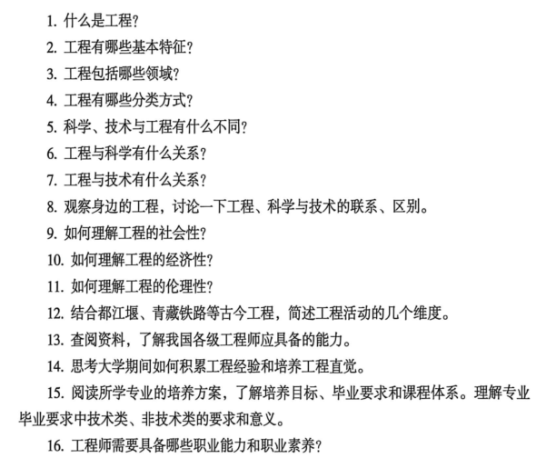

### 习题 1

**题目**：什么是工程？

**参考答案**（仅供参考）

工程是人类运用科学知识、技术工具和实践经验，有计划、有目的、有组织地改造物质世界，优化利用自然资源，最终为人类服务的活动。

### 习题 2

**题目**：工程有哪些基本特征？

**参考答案**（仅供参考）

基本特征（内在属性）：社会性；科学性与创造性；系统性与复杂性；实践性与经验性；自然性与生态性；风险性。

### 习题 3

**题目**：工程包括哪些领域？

**参考答案**（仅供参考）

包括土木、机械、电子、化工、计算机、航空航天、生物工程等众多领域，可按专业门类划分。

### 习题 4

**题目**：工程有哪些分类方式？

**参考答案**（仅供参考）

可按范围（广义/狭义）、被改造对象（自然/社会）、规模、复杂度、要素投入（劳动/资本/技术密集）、出现次序（传统/现代）、专业门类等分类。

### 习题 5

**题目**：科学、技术与工程有什么不同？

**参考答案**（仅供参考）

| 维度 | 科学 | 技术 | 工程 |
| --- | --- | --- | --- |
| 本质 | 发现规律 | 发明方法 | 集成建造 |
| 目标 | 认识世界 | 应用科学 | 做成系统/产品 |
| 成果 | 理论、定律 | 工艺、设备 | 工程实体、产品 |

### 习题 6

**题目**：工程与科学有什么关系？

**参考答案**（仅供参考）

科学为工程提供理论基础和原理；工程应用科学成果解决实际问题，并反过来提出新的科学问题。

### 习题 7

**题目**：工程与技术有什么关系？

**参考答案**（仅供参考）

技术是工程实现目标的手段和工具；工程是技术的集成、组织与系统化应用。

### 习题 8

**题目**：观察身边的工程，讨论一下工程、科学与技术的联系、区别。

**参考答案**（仅供参考）

联系：科学→技术→工程形成链条。区别：科学重「为什么」，技术重「怎么做」，工程重「做成什么、如何组织资源交付」。举例：5G 理论（科学）→ 调制算法与芯片（技术）→ 基站网络建设（工程）。

### 习题 9

**题目**：如何理解工程的社会性？

**参考答案**（仅供参考）

工程服务于社会需求，受政策、文化、公众接受度影响；工程师须考虑公共安全与社会福祉（如青藏铁路兼顾生态与民生）。

### 习题 10

**题目**：如何理解工程的经济性？

**参考答案**（仅供参考）

工程需考虑投资、成本、收益与资源约束；计划阶段要做经济决策，判断项目是否值得开发。

### 习题 11

**题目**：如何理解工程的伦理性？

**参考答案**（仅供参考）

工程决策须符合职业伦理，生命至上，不能为效益牺牲公众安全（联系第4章伦理规范）。

### 习题 12

**题目**：结合都江堰、青藏铁路等古今工程，简述工程活动的几个维度。

**参考答案**（仅供参考）

工程活动七维度：技术、管理、哲学、经济、社会、生态、伦理。都江堰：系统治水+生态+长期效益；青藏铁路：高寒技术+生态保护+民族团结。

### 习题 13

**题目**：查阅资料，了解我国各级工程师应具备的能力。

**参考答案**（仅供参考）

我国工程师应具：专业技术能力、工程实践经验、职业道德与法规意识、团队协作与沟通、终身学习能力；各级职称对应不同深度（助理→中级→高级）。

### 习题 14

**题目**：思考大学期间如何积累工程经验和培养工程直觉。

**参考答案**（仅供参考）

参加竞赛/项目实践、课程设计、企业实习；多观察真实工程案例；培养「整体+约束+全周期」思维，而非只盯单一技术点。

### 习题 15

**题目**：阅读所学专业的培养方案，了解培养目标、毕业要求和课程体系。理解专业毕业要求中技术类、非技术类的要求和意义。

**参考答案**（仅供参考）

培养方案明确培养目标与毕业要求；技术类要求（如编程、设计）保证专业能力，非技术类（伦理、管理、经济）保证复杂工程问题解决能力，二者缺一不可。

### 习题 16

**题目**：工程师需要具备哪些职业能力和职业素养？

**参考答案**（仅供参考）

职业能力：专业知识、问题分析、设计开发、研究、使用现代工具、工程与社会、职业规范、个人与团队、沟通、项目管理、终身学习。职业素养：诚信、责任、生命至上、持续改进。

---

# 第2章 产品开发流程

> **参考答案（仅供参考）**：综合《工程概论》教材、`notes/` 分章笔记、课件与 MOOC 要点整理，**非官方标准答案**；开放题、案例分析题需结合个人专业与项目举例。

## 教材原题（截图）

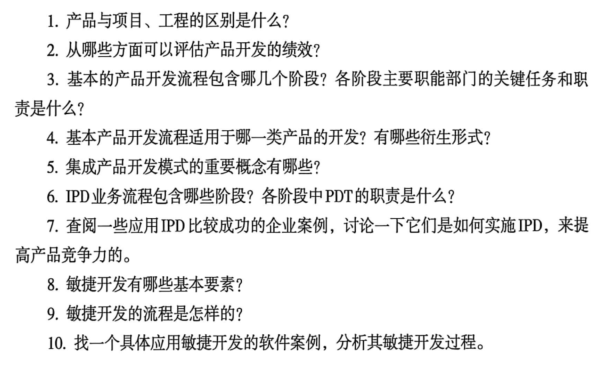

### 习题 1

**题目**：产品与项目、工程的区别是什么？

**参考答案**（仅供参考）

产品：可交付的有形/无形成果；项目：为创造独特成果而进行的临时性工作；工程：更广泛的活动与系统，可包含多个项目与产品全生命周期。

### 习题 2

**题目**：从哪些方面可以评估产品开发的绩效？

**参考答案**（仅供参考）

时间（周期）、成本、质量、市场表现（销量/份额）、可靠性、可制造性、客户满意度、经济回报等。

### 习题 3

**题目**：基本的产品开发流程包含哪几个阶段？各阶段主要职能部门的关键任务和职责是什么？

**参考答案**（仅供参考）

| 阶段 | 核心任务 | 职能部门 |
| --- | --- | --- |
| 概念 | 产品策划、定义 | 市场、研发 |
| 计划 | 总体方案、经济决策 | 研发、财务 |
| 开发 | 设计实现 | 研发、制造 |
| 验证 | 系统测试 | 质量、测试 |
| 发布 | 确认可投放市场 | 市场、运营 |
| 生命周期 | 生产、维护、迭代/终止 | 制造、服务 |

### 习题 4

**题目**：基本产品开发流程适用于哪一类产品的开发？有哪些衍生形式？

**参考答案**（仅供参考）

适用于多数硬件与复杂产品；衍生形式：技术推动型、平台型、流程密集型、定制型、高风险型、快速构建型、复杂系统型等七种。

### 习题 5

**题目**：集成产品开发模式的重要概念有哪些？

**参考答案**（仅供参考）

市场驱动、跨职能团队 CFT、结构化流程、阶段门 Gate、DCP 决策评审、TR 技术评审、CBB 共用模块、MM/OR 需求与市场管理。

### 习题 6

**题目**：IPD业务流程包含哪些阶段？各阶段中PDT的职责是什么？

**参考答案**（仅供参考）

IPD 阶段含概念、计划、开发、验证、发布等；PDT（产品开发团队）在各阶段负责跨职能协同、交付阶段成果、通过 DCP/TR 评审。

### 习题 7

**题目**：查阅一些应用IPD比较成功的企业案例，讨论一下它们是如何实施IPD，来提高产品竞争力的。

**参考答案**（仅供参考）

案例框架：华为、IBM 等引入 IPD → 市场牵引 + 跨部门并行 + 阶段门控风险 → 缩短周期、提高成功率。答题写：结构化流程、重用 CBB、决策评审。

### 习题 8

**题目**：敏捷开发有哪些基本要素？

**参考答案**（仅供参考）

要素：敏捷宣言四价值观；短迭代 Sprint、Product Backlog、自组织团队、持续反馈、可用增量 Increment。

### 习题 9

**题目**：敏捷开发的流程是怎样的？

**参考答案**（仅供参考）

Product Backlog → Sprint 计划（1–4 周）→ 开发测试 → 评审回顾 → 交付增量 → 反馈迭代。

### 习题 10

**题目**：找一个具体应用敏捷开发的软件案例，分析其敏捷开发过程。

**参考答案**（仅供参考）

开放题框架：选 Spotify/微信某功能迭代等 → 短周期发布 → 用户反馈驱动 Backlog → 体现拥抱变化、持续交付。

---

# 第3章 系统工程方法

> **参考答案（仅供参考）**：综合《工程概论》教材、`notes/` 分章笔记、课件与 MOOC 要点整理，**非官方标准答案**；开放题、案例分析题需结合个人专业与项目举例。

## 教材原题（截图）

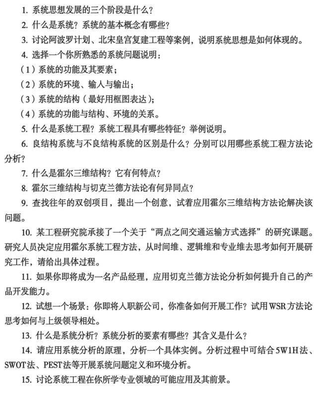

### 习题 1

**题目**：系统思想发展的三个阶段是什么？

**参考答案**（仅供参考）

古代朴素整体观 → 近代分析还原论 → 现代科学系统观（整体与部分统一、定性与定量结合）。

### 习题 2

**题目**：什么是系统？系统的基本概念有哪些？

**参考答案**（仅供参考）

系统是由相互联系、依赖、制约、作用的要素构成的有机整体。基本概念：要素、结构、功能、环境、输入、输出、边界、目标等；特征：整体性、目的性、相关性、层次性、涌现性、动态性、环境适应性。

### 习题 3

**题目**：讨论阿波罗计划、北宋皇宫复建工程等案例，说明系统思想是如何体现的。

**参考答案**（仅供参考）

阿波罗：多子系统（火箭、飞船、测控）集成、整体目标导向；北宋皇宫复建/丁谓修宫：一举三役，整体优化取土、运材、垃圾处理。

### 习题 4

**题目**：选择一个你所熟悉的系统问题说明：(1)系统的功能及其要素；(2)系统的环境、输入与输出；(3)系统的结构（最好用框图表达）；(4)系统的功能与结构、环境的关系。

**参考答案**（仅供参考）

开放题：选校园/专业系统 → 写清功能、要素、环境、输入输出、结构框图、功能-结构-环境关系（按题目四点作答）。

### 习题 5

**题目**：什么是系统工程？系统工程具有哪些特征？举例说明。

**参考答案**（仅供参考）

系统工程：以系统为对象，运用系统思想组织管理大型复杂工程的实践活动，追求整体最优。特征：综合性、目标整体最优、先整体后详细、观点原则优先于数学工具。

### 习题 6

**题目**：良结构系统与不良结构系统的区别是什么？分别可以用哪些系统工程方法论分析？

**参考答案**（仅供参考）

良结构（硬系统）：目标清晰、可建模 → 霍尔三维；不良/软系统：目标模糊、人的因素多 → 切克兰德方法论。

### 习题 7

**题目**：什么是霍尔三维结构？它有何特点？

**参考答案**（仅供参考）

霍尔三维结构 = 时间维（规划→运行 6 阶段）× 逻辑维（7 步骤）× 专业维（多学科）。特点：结构化、阶段化、强调整体最优与专业协同。

### 习题 8

**题目**：霍尔三维结构与切克兰德方法论有何异同点？

**参考答案**（仅供参考）

| 对比 | 霍尔 | 切克兰德 |
| --- | --- | --- |
| 对象 | 硬系统 | 软系统 |
| 方法 | 三维矩阵、偏定量 | 7 步循环、偏定性参与 |
| 同 | 都强调系统整体观 | — |

### 习题 9

**题目**：查找往年的双创项目，提出一个创意，试着应用霍尔三维结构方法论解决该问题。

**参考答案**（仅供参考）

开放题：提出双创创意 → 按时间维排阶段、逻辑维走七步、专业维列所需学科（如软件+硬件+市场）。

### 习题 10

**题目**：某工程研究院承接了一个关于「两点之间交通运输方式选择」的研究课题。研究人员决定应用霍尔系统工程方法，从时间维、逻辑维和专业维去思考如何开展研究工作，请给出具体过程。

**参考答案**（仅供参考）

时间维：规划→方案→研制→…；逻辑维：明确问题→确定目标→综合→分析→优化→决策→实施；专业维：交通工程、经济、环境、管理等分别开展调研与方案比选。

### 习题 11

**题目**：如果你即将成为一名产品经理，应用切克兰德方法论分析如何提升自己的产品开发能力。

**参考答案**（仅供参考）

切克兰德 7 步：认识问题情境 → 根底定义 → 建立概念模型 → 比较探讨 → 选择 → 设计实施 → 评估反馈。用于梳理产品能力短板与改进路径。

### 习题 12

**题目**：试想一个场景：你即将入职新公司，你准备如何开展工作？试用WSR方法论思考如何与上级领导相处。

**参考答案**（仅供参考）

WSR（物理-事理-人理）：物理维做好本职工作；事理维理清流程与目标；人理维理解上级期望、主动沟通、建立信任。

### 习题 13

**题目**：什么是系统分析？系统分析的要素有哪些？其含义是什么？

**参考答案**（仅供参考）

系统分析：对系统问题采用定性与定量方法，寻求可行、非劣、优选方案。六要素：目标、方案、模型、费用、效果、准则（及评价标准）。

### 习题 14

**题目**：请应用系统分析的原理，分析一个具体实例。分析过程中可结合5W1H法、SWOT法、PEST法等开展系统问题定义和环境分析。

**参考答案**（仅供参考）

开放题：选实例 → 5W1H 定义问题 → SWOT/PEST 环境分析 → 提出方案 → 评价选优。

### 习题 15

**题目**：讨论系统工程在你所学专业领域的可能应用及其前景。

**参考答案**（仅供参考）

开放题：结合专业写 1–2 个应用场景（如软件系统架构优化、生产线调度）及前景（数字化、复杂化驱动系统方法普及）。

---

# 第4章 工程与伦理

> **参考答案（仅供参考）**：综合《工程概论》教材、`notes/` 分章笔记、课件与 MOOC 要点整理，**非官方标准答案**；开放题、案例分析题需结合个人专业与项目举例。

## 教材原题（截图）

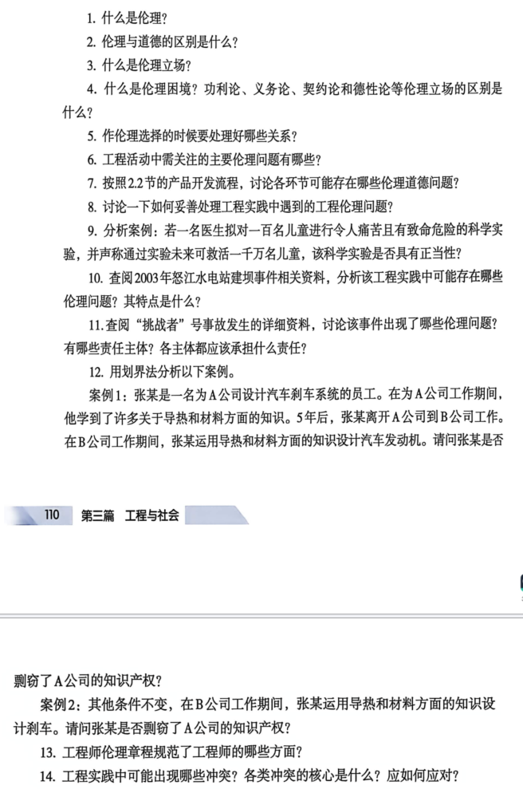

### 习题 1

**题目**：什么是伦理？

**参考答案**（仅供参考）

伦理：处理人与人、人与社会、人与自然关系应遵循的规则（偏社会、客观、普遍）。

### 习题 2

**题目**：伦理与道德的区别是什么？

**参考答案**（仅供参考）

伦理侧重社会规范与「应当」；道德侧重个人内在善恶标准与德性（偏主观、情境）。

### 习题 3

**题目**：什么是伦理立场？

**参考答案**（仅供参考）

伦理立场：分析道德问题时所依据的基本理论取向（功利、义务、美德、契约等）。

### 习题 4

**题目**：什么是伦理困境？功利论、义务论、契约论和德性论等伦理立场有何区别？

**参考答案**（仅供参考）

伦理困境：多种道德义务冲突、难以两全。四立场：功利论看后果；义务论看可普遍化准则；契约论看公平规则；美德论看品格。区别见笔记对比表。

### 习题 5

**题目**：作伦理选择的时候要处理好哪些关系？

**参考答案**（仅供参考）

处理好：个人与公众、雇主与客户、效率与安全、短期与长期、技术可行与道德底线等关系。

### 习题 6

**题目**：工程活动中需关注的主要伦理问题有哪些？

**参考答案**（仅供参考）

五类：技术伦理、利益伦理、责任伦理、环境伦理、现代典型伦理（如数据隐私、AI）。

### 习题 7

**题目**：按照2.2节的产品开发流程，讨论各环节可能存在哪些伦理道德问题？

**参考答案**（仅供参考）

按七阶段：概念（目标是否伤害公众）→ 计划（经济 vs 安全）→ 开发（可靠性）→ 验证（测试充分性）→ 发布（隐瞒缺陷）→ 生命周期（报废污染）。

### 习题 8

**题目**：讨论一下如何妥善处理工程实践中遇到的工程伦理问题？

**参考答案**（仅供参考）

识别问题 → 明确利益相关方 → 运用划界法/中间道路/功利分析 → 遵循生命至上 → 必要时拒绝违法或危险指令并记录报告。

### 习题 9

**题目**：分析案例：若一名医生拟对一百名儿童进行令人痛苦且有致命危险的科学实验，并声称通过实验未来可救活一千万名儿童，该科学实验是否具有正当性？

**参考答案**（仅供参考）

义务论/权利论：不能将儿童仅作手段，实验不正当。功利论：即使声称救千万人，亦须尊重基本权利与知情同意，不能简单量化牺牲。

### 习题 10

**题目**：查阅2003年怒江水电站建坝事件相关资料，分析该工程实践中可能存在哪些伦理问题？其特点是什么？

**参考答案**（仅供参考）

涉及环境伦理（生态）、利益伦理（移民与地方利益）、责任伦理（决策透明）、程序公正等；特点：多方利益冲突、长期影响、信息公开不足。

### 习题 11

**题目**：查阅「挑战者」号事故发生的详细资料，讨论该事件出现了哪些伦理问题？有哪些责任主体？各主体都应该承担什么责任？

**参考答案**（仅供参考）

挑战者号伦理问题：已知 O 型环低温风险仍发射；忽视工程师警告。
责任主体：NASA 管理层、承包商、工程师。责任：管理层决策失误；工程师应坚持安全否决权；承包商提供准确数据。
核心：违背生命至上与预防性伦理。

### 习题 12

**题目**：用划界法分析以下案例。案例1：张某为A公司设计刹车系统，离职到B公司后用导热和材料知识设计发动机，是否剽窃A公司知识产权？案例2：其他条件不变，在B公司设计刹车，是否剽窃？

**参考答案**（仅供参考）

案例1：设计**发动机**，领域不同，一般**不构成**剽窃（通用知识）；案例2：设计**刹车**，与前任工作直接竞争，存在**商业秘密/竞业**风险，可能侵权。划界：是否使用专属于 A 的保密设计细节。

### 习题 13

**题目**：工程师伦理章程规范了工程师的哪些方面？

**参考答案**（仅供参考）

规范工程师：公众安全健康福祉优先、诚信公正、专业胜任、忠诚与责任、尊重同行、环境保护与可持续等（职业伦理章程六条）。

### 习题 14

**题目**：工程实践中可能出现哪些冲突？各类冲突的核心是什么？应如何应对？

**参考答案**（仅供参考）

冲突：利益冲突、角色冲突、价值观冲突。核心：公众安全 vs 商业/政治压力。应对：披露冲突、第三方审查、拒绝违规指令、记录并报告隐患。

---

# 第5章 工程与法律法规

> **参考答案（仅供参考）**：综合《工程概论》教材、`notes/` 分章笔记、课件与 MOOC 要点整理，**非官方标准答案**；开放题、案例分析题需结合个人专业与项目举例。

## 教材原题（截图）

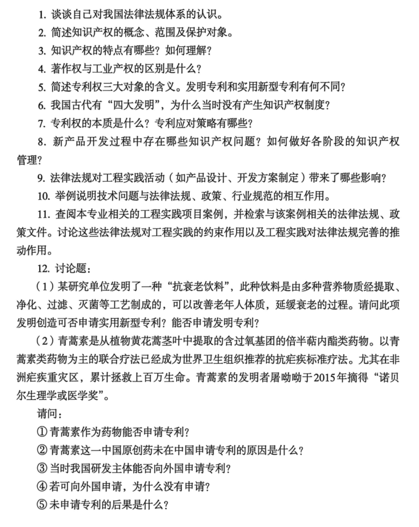

### 习题 1

**题目**：谈谈自己对我国法律法规体系的认识。

**参考答案**（仅供参考）

宪法 → 法律 → 行政法规 → 地方性法规 → 规章；下位不得抵触上位。工程活动须在法律框架内进行，合规是技术可行的前提。

### 习题 2

**题目**：简述知识产权的概念、范围及保护对象。

**参考答案**（仅供参考）

知识产权是对智力成果享有的专有权利；范围含专利、商标、著作权、商业秘密等；保护对象为智力创造成果。

### 习题 3

**题目**：知识产权的特点有哪些？如何理解？

**参考答案**（仅供参考）

特点：独占性、地域性、时效性。理解：鼓励创新但有限期垄断，需依法申请与维护。

### 习题 4

**题目**：著作权与工业产权的区别是什么？

**参考答案**（仅供参考）

著作权保护**表达形式**（文字、代码、图形）；工业产权保护**发明、实用新型、外观设计**等工业应用成果。

### 习题 5

**题目**：简述专利权三大对象的含义。发明专利和实用新型专利有何不同？

**参考答案**（仅供参考）

专利三对象：发明、实用新型、外观设计。发明与实用新型：发明保护范围广、创造性要求高、审查严（20年）；实用新型仅结构形状、审查相对简（10年）。

### 习题 6

**题目**：我国古代有「四大发明」，为什么当时没有产生知识产权制度？

**参考答案**（仅供参考）

当时以经验传承为主，缺乏现代市场经济与专利制度；知识被视为公有而非私有财产。

### 习题 7

**题目**：专利权的本质是什么？专利应对策略有哪些？

**参考答案**（仅供参考）

本质：有限期的合法垄断。应对：专利避让、许可费、交叉许可、自身布局。

### 习题 8

**题目**：新产品开发过程中存在哪些知识产权问题？如何做好各阶段的知识产权管理？

**参考答案**（仅供参考）

问题：归属不清、侵权、泄露。管理：立项查重、合同明确 IP 归属、申请专利、保密协议、各阶段文档与开源合规审查。

### 习题 9

**题目**：法律法规对工程实践活动（如产品设计、开发方案制定）带来了哪些影响？

**参考答案**（仅供参考）

影响：准入许可（进网、环保）、安全责任、合同约束、知识产权、数据合规等，贯穿设计开发全过程。

### 习题 10

**题目**：举例说明技术问题与法律法规、政策、行业规范的相互作用。

**参考答案**（仅供参考）

例：5G 进网须符合《电信条例》；软件需符合网络安全法；产品标准与法律共同约束上市。

### 习题 11

**题目**：查阅本专业相关的工程实践项目案例，检索相关法律法规、政策文件，讨论约束作用与完善推动作用。

**参考答案**（仅供参考）

开放题：选专业案例 → 检索相关法规 → 写约束作用（必须满足）与推动完善（实践反馈立法）。

### 习题 12

**题目**：讨论题：(1)「抗衰老饮料」可否申请实用新型/发明专利？(2)青蒿素能否申请专利？未在中国申请的原因？能否向外国申请？未申请后果？

**参考答案**（仅供参考）

(1) 饮料属**方法/产品**，可申请**发明专利**；通常不属于实用新型保护的「形状构造」。
(2) 青蒿素：① 天然提取物本身难专利，复方/工艺可专利；② 当时科研体制与专利意识不足；③ 1980s 后逐步可以向外申请；④ 未国际化布局；⑤ 后果：国际市场利益流失（诺华许可案例）。

---

# 第6章 工程与标准化、可持续发展

> **参考答案（仅供参考）**：综合《工程概论》教材、`notes/` 分章笔记、课件与 MOOC 要点整理，**非官方标准答案**；开放题、案例分析题需结合个人专业与项目举例。

## 教材原题（截图）

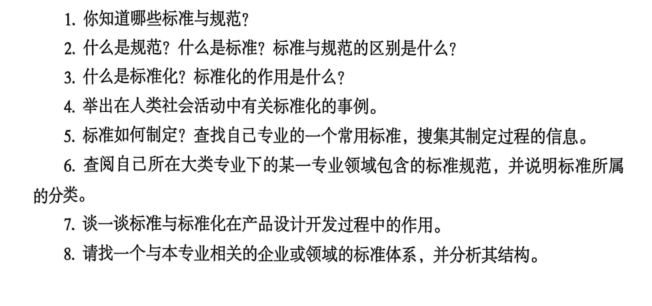

### 习题 1

**题目**：你知道哪些标准与规范？

**参考答案**（仅供参考）

例：GB 国标、GB/T 推荐国标、ISO 国际标准、行业标准（如通信 YD）、企业标准等。

### 习题 2

**题目**：什么是规范？什么是标准？标准与规范的区别是什么？

**参考答案**（仅供参考）

标准：经批准的技术规则文件；规范：对技术要求的更具体化文件。区别：标准强调统一性与通用性；规范常针对特定对象；实践中常配合使用。

### 习题 3

**题目**：什么是标准化？标准化的作用是什么？

**参考答案**（仅供参考）

标准化：制定、发布、实施标准的活动。作用：统一技术要求、保证质量、促进互操作、降低成本、保障安全。

### 习题 4

**题目**：举出在人类社会活动中有关标准化的事例。

**参考答案**（仅供参考）

例：国际单位制、USB 接口、铁路轨距、字符编码 UTF-8、食品标签标准等。

### 习题 5

**题目**：标准如何制定？查找自己专业的一个常用标准，搜集其制定过程的信息。

**参考答案**（仅供参考）

制定：提案→起草→征求意见→审查→批准→发布→实施。开放题：查本专业一标准（如 GB/T xxxx）的发布部门与修订历史。

### 习题 6

**题目**：查阅自己所在大类专业下的某一专业领域包含的标准规范，并说明标准所属的分类。

**参考答案**（仅供参考）

开放题：列专业相关标准（如软件工程 GB/T 8566）并说明级别（国家/行业/企业）。

### 习题 7

**题目**：谈一谈标准与标准化在产品设计开发过程中的作用。

**参考答案**（仅供参考）

全周期：概念阶段可行性标准 → 开发阶段设计/材料标准 → 验证阶段测试方法 → 发布阶段认证与环保标准。

### 习题 8

**题目**：请找一个与本专业相关的企业或领域的标准体系，并分析其结构。

**参考答案**（仅供参考）

开放题：描述某企业标准体系（如 ISO 9001 质量管理体系 + 产品标准 + 检测标准）的层次结构。

---

# 第7章 工程项目的经济决策基础

> 官方答案：`第7章 工程经济决策基础课后作业题目及参考答案.pdf`（计算/必做题以 PDF 为准）
> 无官方 PDF 的习题见下方「仅供参考」补充答案。

## 教材原题（截图）

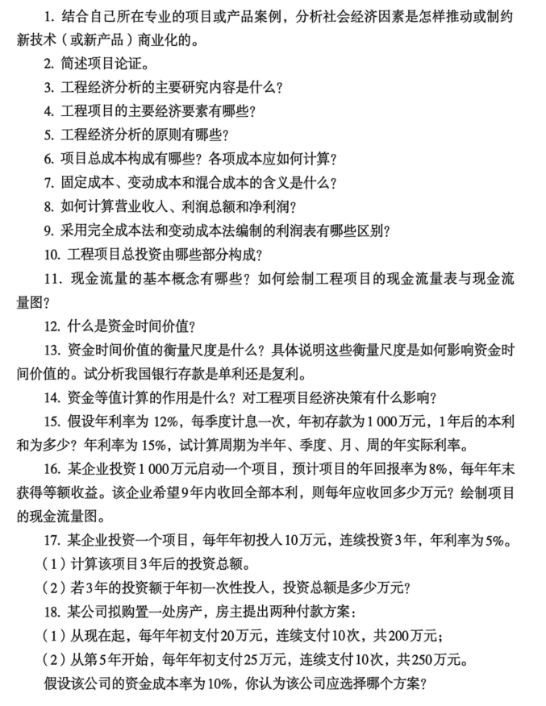

### 习题 1

**题目**：结合自己所在专业的项目或产品案例，分析社会经济因素是怎样推动或制约新技术（或新产品）商业化的。

**参考答案**（仅供参考）

开放题框架：推动—市场需求、政策、资本；制约—法规、标准、成本、伦理。结合本专业产品举例。

### 习题 2

**题目**：简述项目论证。

**参考答案**（仅供参考）

项目论证：从市场预测起的技术经济研究，评价必要性、先进性、经济性，给出可行/不可行结论。作用：立项、筹资、设计采购、防风险、申请核准依据。

### 习题 3

**题目**：工程经济分析的主要研究内容是什么？

**参考答案**（仅供参考）

经济要素、资金时间价值、效果评价、方案比选、不确定性分析（敏感/盈亏/风险）。

### 习题 4

**题目**：工程项目的主要经济要素有哪些？

**参考答案**（仅供参考）

成本、收入、税金、利润、投资、现金流量等。

### 习题 5

**题目**：工程经济分析的原则有哪些？

**参考答案**（仅供参考）

资金时间价值、现金流量基础、费用效益可比、全寿命周期、定性定量结合、多方案优选、风险收益权衡。

### 习题 6

**题目**：项目总成本构成有哪些？各项成本应如何计算？

**参考答案**（仅供参考）

生产要素法：原材料+燃料动力+工资福利+修理+折旧+摊销+利息+其他；各项按产量×单耗×单价或定额计算。

### 习题 7

**题目**：固定成本、变动成本和混合成本的含义是什么？

**参考答案**（仅供参考）

固定：不随产量变；变动：正比产量；混合：部分固定部分变动。

### 习题 8

**题目**：如何计算营业收入、利润总额和净利润？

**参考答案**（仅供参考）

营业收入=单价×销量；营业利润=收入−成本费用；利润总额=营业利润±营业外；净利润=利润总额−所得税。

### 习题 9

**题目**：采用完全成本法和变动成本法编制的利润表有哪些区别？

**参考答案**（仅供参考）

完全成本法将固定制造费用分摊进产品；变动成本法当期费用化。利润表数字可能不同，边际贡献一致。

### 习题 10

**题目**：工程项目总投资由哪些部分构成？

**参考答案**（仅供参考）

总投资=固定资产+无形资产+其他资产（开办费）+流动资金。

### 习题 11

**题目**：现金流量的基本概念有哪些？如何绘制工程项目的现金流量表与现金流量图？

**参考答案**（仅供参考）

CI 流入、CO 流出、NCF=CI−CO；图：时间轴向右，上正下负；表按年列收支。

### 习题 12

**题目**：什么是资金时间价值？

**参考答案**（仅供参考）

同等金额不同时点价值不同，须折现到同一时点比较。

### 习题 13

**题目**：资金时间价值的衡量尺度是什么？具体说明这些衡量尺度是如何影响资金时间价值的。试分析我国银行存款是单利还是复利。

**参考答案**（仅供参考）

衡量尺度为利率/折现率；计息方式、频率、风险通胀均影响。我国定期存款按复利滚存，活期等短期多为单利。

### 习题 14

**题目**：资金等值计算的作用是什么？对工程项目经济决策有什么影响？

**参考答案**（仅供参考）

等值计算使不同时间点金额可比，是 NPV 比选和方案决策的基础。

### 习题 15

**题目**：假设年利率为12%，每季度计息一次，年初存款为1000万元，1年后的本利和为多少？年利率为15%，试计算周期为半年、季度、月、周的年实际利率。

**参考答案**（官方 PDF）

**（PDF 参考答案）**

（1）年利率 12%，每季度计息，年初存 1000 万，1 年后本利和  
季度利率 i/4 = 3%，计息周期 n = 4  
F = 1000×(1+3%)⁴ ≈ **1125.51 万元**

（2）年利率 15% 各周期**有效年利率** r = (1 + r/m)^m − 1  

| 计息周期 | m | 有效年利率 |
| --- | --- | --- |
| 半年 | 2 | ≈ **15.56%** |
| 季度 | 4 | ≈ **15.87%** |
| 月 | 12 | ≈ **16.08%** |
| 周 | 52 | ≈ **16.18%** |

**解题方法**：计息周期 ≠ 1 年 → 先算周期利率 → 复利求 F；名义利率换算用有效年利率公式。

### 习题 16

**题目**：某企业投资1000万元启动一个项目，预计项目的年回报率为8%，每年年末获得等额收益。该企业希望9年内收回全部本利，则每年应收回多少万元？绘制项目的现金流量图。

**参考答案**（官方 PDF）

**（PDF 参考答案）**

A = P×(A/P, 8%, 9) = 1000×0.16008 = **160.08 万元/年**

**现金流量图**：t=0 流出 1000 万；t=1～9 各流入 160.08 万。

**解题方法**：已知 P、i、n，求期末等额 A → 资本回收系数 (A/P) 或 Excel `PMT(8%,9,-1000)`。

### 习题 17

**题目**：某企业投资一个项目，每年年初投入10万元，连续投资3年，年利率为5%。(1)计算该项目3年后的投资总额。(2)若3年的投资额于年初一次性投入，投资总额是多少万元？

**参考答案**（官方 PDF）

**（PDF 参考答案）**

(1) 每年**年初**投入 10 万，连续 3 年，i=5% → **预付年金终值**  
F = 10×(F/A,5%,3)×(1+5%) ≈ **33.10 万元**

(2) 30 万于第 1 年初一次性投入：F = 30×(1.05)³ ≈ **34.73 万元**

**解题方法**：年初收付 = 普通年金结果 ×(1+i)。

### 习题 18

**题目**：某公司拟购置一处房产，房主提出两种付款方案：(1)从现在起，每年年初支付20万元，连续支付10次；(2)从第5年开始，每年年初支付25万元，连续支付10次。资金成本率10%，应选择哪个方案？

**参考答案**（官方 PDF）

**（PDF 参考答案）**

i = 10%（资金成本率即折现率），**比较两方案现值，选现值较小者**。

- **方案(1)**：每年年初付 20，n=10 → 即付年金现值 P₁ = 20×(P/A,10%,10)×(1+10%) ≈ **135.18 万**
- **方案(2)**：第 5 年初起付 25×10 期 → 先折到第 4 年末，再折到第 0 期 → P₂ ≈ **115.38 万**

**结论**：P₁ > P₂，**应选方案(2)**。

**解题方法**：两串不等额现金流 → 统一折现到 t=0 → 比 PV 大小。

---

# 第8章 工程项目的经济决策方法

> 官方答案：`第8章 工程经济决策方法的课后作业题目及参考答案.pdf`（计算/必做题以 PDF 为准）
> 无官方 PDF 的习题见下方「仅供参考」补充答案。

## 教材原题（截图）

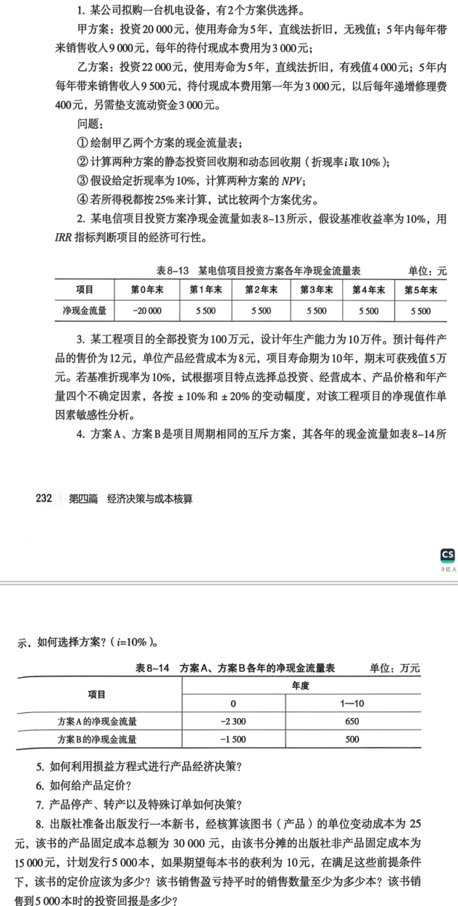

### 习题 1

**题目**：某公司拟购一台机电设备（甲乙两方案，见教材表）。要求：①现金流量表；②静态/动态回收期(i=10%)；③NPV；④所得税25%比较优劣。

**参考答案**（官方 PDF）

**（PDF 参考答案）**

**(1) 税后现金流量表**（所得税 25%，直线折旧；乙 0 年含流动资金 3000）

| 方案 | 0年 | 1-5年 NCF | 要点 |
| --- | --- | --- | --- |
| 甲 | -20000 | 各 5500 | 折旧 4000/年，无残值 |
| 乙 | -25000 | 5775,5475,5175,4875,11575 | 残值4000+流动资金回收 |

**(2) 回收期**  
- 静态：Pt_甲 ≈ **3.64 年**；Pt_乙 ≈ **4.32 年**  
- 动态：PD_甲 = 5−1+(3415.07−2565.74)/3415.07 ≈ **4.24 年**；PD_乙 > 5 年（累计折现现值终值为负）

**(3) NPV（i=10%）**  
- NPV_甲 = −20000 + 5500×(P/A,10%,5) ≈ **849 元**  
- NPV_乙 ≈ **−820 元**

**(4) 结论**：**NPV_甲 > NPV_乙，选甲方案**。

**解题方法**：税后 NCF 表 → 累计 → PBT 插值 → 折现 NPV → 互斥选 NPV 最大且为正。

### 习题 2

**题目**：某电信项目NCF：0年-20000，1-5年各5500元，基准10%，用IRR判断可行性。

**参考答案**（官方 PDF）

**（PDF 参考答案）**

Excel `IRR` 计算：**IRR = 11.649% > 10%** → **方案可行**。

**解题方法**：求使 NPV=0 的折现率；IRR ≥ 基准收益率 → 可行。

### 习题 3

**题目**：投资100万，年产10万件，售价12元，成本8元，寿命10年，残值5万，i=10%。对投资、成本、价格、产量作±10%、±20%单因素敏感性分析。

**参考答案**（官方 PDF）

**（PDF 参考答案）**

NPV = −投资 + (价格−经营成本)×年产量×(P/A,10%,10) + 残值×(P/F,10%,10)

**单因素敏感性结论**（PDF）：
- 投资、经营成本变动与 NPV **反向**
- 价格、产量变动与 NPV **同向**
- **最敏感**：**产品销售价格**（变动 1%，NPV 约变动 7.37%）
- 其次：单位经营成本 → 年产量 → **最不敏感**：总投资

**解题方法**：算基准 NPV → 单因素 ±10%/±20% 重算 → 比较敏感度系数。

### 习题 4

**题目**：互斥方案A(-2300+650×10)与B(-1500+500×10)，i=10%，如何选择？

**参考答案**（仅供参考）

NPV_A = −2300 + 650×(P/A,10%,10) ≈ **1693.97 万**
NPV_B = −1500 + 500×(P/A,10%,10) ≈ **1572.28 万**
两方案 NPV 均>0；互斥且寿命相同 → **选 A**（NPV 更大）。
注意：B 的 IRR 更高，但互斥方案**以 NPV 为准**。

### 习题 5

**题目**：如何利用损益方程式进行产品经济决策？

**参考答案**（仅供参考）

损益方程：利润 = (P−V)×Q − F。用于预测利润、求保本量 QBEP、短期定价与停产决策。

### 习题 6

**题目**：如何给产品定价？

**参考答案**（仅供参考）

短期：P > 单位变动成本；长期：覆盖变动+分摊固定+目标利润；成本加成法反推单价。

### 习题 7

**题目**：产品停产、转产以及特殊订单如何决策？

**参考答案**（仅供参考）

停产：边际贡献<0 且固定成本可避免；转产：比较边际贡献；特殊订单：价格>单位变动成本可接受（短期）。

### 习题 8

**题目**：出版社新书：V=25元，产品固定3万，非产品固定1.5万，计划5000本，期望利润10元/本。求定价、保本量、5000本利润。

**参考答案**（官方 PDF）

**（PDF 参考答案）**

**(1) 定价**  
最低可接受单价 = V + F产/Q + F非/Q + 单位目标利润  
= 25 + 30000/5000 + 15000/5000 + 10 = **44 元/本**

**(2) 保本量**  
QBEP = (30000+15000)/(44−25) = **2369 本**（至少）

**(3) 5000 本利润**  
= 44×5000 − 25×5000 − 30000 − 15000 = **50000 元**

**解题方法**：定价公式 → QBEP = 总固定/(P−V) → 利润 = (P−V)×Q − 总固定。

---

# 第9章 工程项目管理概述

> **参考答案（仅供参考）**：综合《工程概论》教材、`notes/` 分章笔记、课件与 MOOC 要点整理，**非官方标准答案**；开放题、案例分析题需结合个人专业与项目举例。

## 教材原题（截图）

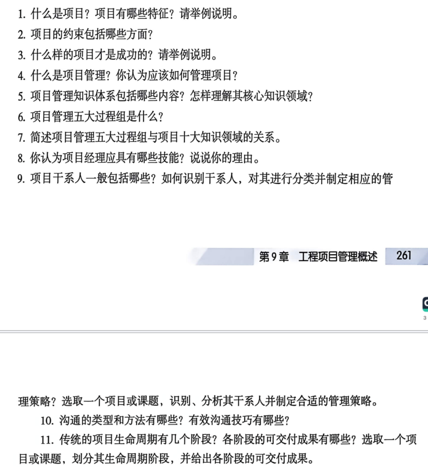

### 习题 1

**题目**：什么是项目？项目有哪些特征？请举例说明。

**参考答案**（仅供参考）

项目：为创造独特的产品、服务或成果而进行的临时性工作。特征：独特、临时、资源有限、渐进明细、有发起人、存在不确定性。例：开发新 App、婚礼策划。

### 习题 2

**题目**：项目的约束包括哪些方面？

**参考答案**（仅供参考）

铁三角：范围、时间、成本（常加质量）。三者相互制约，不能同时任意加码。

### 习题 3

**题目**：什么样的项目才是成功的？请举例说明。

**参考答案**（仅供参考）

成功标准：① 达到范围、时间、成本目标；② 客户/发起人满意；③ 成果达到主要目标。

### 习题 4

**题目**：什么是项目管理？你认为应该如何管理项目？

**参考答案**（仅供参考）

项目管理：运用知识技能工具，在约束下交付可接受成果。管理：五大过程组 + 十大知识领域 + 干系人沟通 + 变更控制。

### 习题 5

**题目**：项目管理知识体系包括哪些内容？怎样理解其核心知识领域？

**参考答案**（仅供参考）

十大领域：整合、范围、进度、成本、质量、资源、沟通、风险、采购、干系人。核心：范围定「做什么」，进度/成本/质量是铁三角。

### 习题 6

**题目**：项目管理五大过程组是什么？

**参考答案**（仅供参考）

启动、规划、执行、监控、收尾。

### 习题 7

**题目**：简述项目管理五大过程组与项目十大知识领域的关系。

**参考答案**（仅供参考）

PMBOK 将约 49 个过程映射到五大过程组×十大领域；如「规划范围管理」属规划组+范围领域。

### 习题 8

**题目**：你认为项目经理应具有哪些技能？说说你的理由。

**参考答案**（仅供参考）

技术知识、项目管理知识、领导力、沟通、问题解决与决策能力。

### 习题 9

**题目**：项目干系人一般包括哪些？如何识别干系人，对其进行分类并制定相应的管理策略？选取一个项目或课题，识别、分析其干系人并制定合适的管理策略。

**参考答案**（仅供参考）

干系人：发起人、客户、用户、团队、供应商、政府等。识别：访谈、头脑风暴、组织图。分类：权力/利益矩阵。策略：重点管理高权力高利益者。

### 习题 10

**题目**：沟通的类型和方法有哪些？有效沟通技巧有哪些？

**参考答案**（仅供参考）

类型：正式/非正式、内部/外部、书面/口头。技巧：明确目标、倾听、反馈、选渠道、记录跟进。

### 习题 11

**题目**：传统的项目生命周期有几个阶段？各阶段的可交付成果有哪些？选取一个项目或课题，划分其生命周期阶段，并给出各阶段的可交付成果。

**参考答案**（仅供参考）

启动→规划→执行→收尾（+监控贯穿）。可交付：章程、计划、可交付成果、验收与总结报告。开放题：按所选项目划分。

---

# 第10章 工程项目启动与范围管理

> **参考答案（仅供参考）**：综合《工程概论》教材、`notes/` 分章笔记、课件与 MOOC 要点整理，**非官方标准答案**；开放题、案例分析题需结合个人专业与项目举例。

## 教材原题（截图）

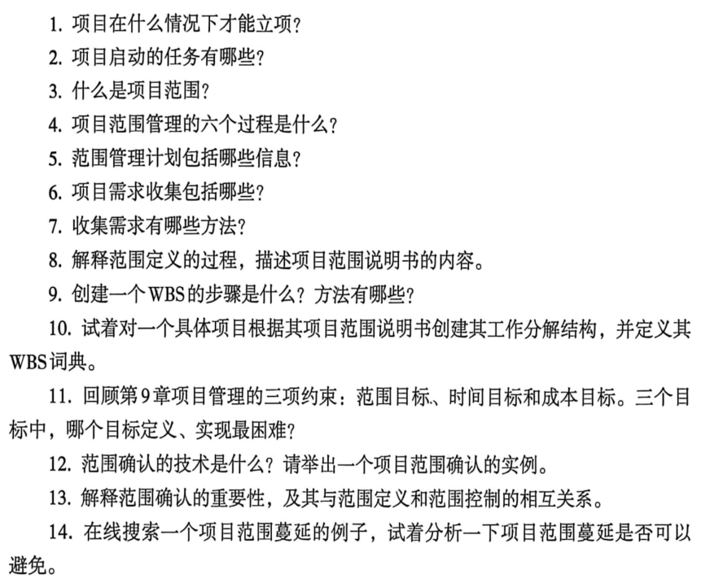

### 习题 1

**题目**：项目在什么情况下才能立项？

**参考答案**（仅供参考）

经项目论证表明技术可行、经济合理、条件可靠，获得发起人/组织正式批准授权后立项。

### 习题 2

**题目**：项目启动的任务有哪些？

**参考答案**（仅供参考）

项目论证、制定章程、识别干系人、召开启动会。

### 习题 3

**题目**：什么是项目范围？

**参考答案**（仅供参考）

项目范围：为交付产品必须完成的全部工作；回答「什么必须做」而非「什么可以做」。

### 习题 4

**题目**：项目范围管理的六个过程是什么？

**参考答案**（仅供参考）

规划范围管理、收集需求、定义范围、创建 WBS、确认范围、控制范围。

### 习题 5

**题目**：范围管理计划包括哪些信息？

**参考答案**（仅供参考）

范围管理计划说明如何定义、验证、控制范围；含流程、角色、工具、验收标准等。

### 习题 6

**题目**：项目需求收集包括哪些？

**参考答案**（仅供参考）

功能需求、非功能需求、业务规则、约束、假设、验收标准等。

### 习题 7

**题目**：收集需求有哪些方法？

**参考答案**（仅供参考）

访谈、焦点小组、问卷、观察、原型、头脑风暴、德尔菲等。

### 习题 8

**题目**：解释范围定义的过程，描述项目范围说明书的内容。

**参考答案**（仅供参考）

定义范围：依据章程与需求编制**范围说明书**——产品描述、交付物、验收标准、除外责任、假设与约束。

### 习题 9

**题目**：创建一个WBS的步骤是什么？方法有哪些？

**参考答案**（仅供参考）

步骤：识别可交付成果→分解→编码→验证 100% 规则。方法：自上而下、模板、类比。

### 习题 10

**题目**：试着对一个具体项目根据其项目范围说明书创建其工作分解结构，并定义其WBS词典。

**参考答案**（仅供参考）

开放题：按项目写 WBS 三层结构 + WBS 词典（工作包描述、负责人、工期）。

### 习题 11

**题目**：回顾第9章项目管理的三项约束：范围目标、时间目标和成本目标。三个目标中，哪个目标定义、实现最困难？

**参考答案**（仅供参考）

**范围**最难：需求易变、难量化、「镀金」与蔓延风险大；且范围错误会导致时间成本连锁偏差。

### 习题 12

**题目**：范围确认的技术是什么？请举出一个项目范围确认的实例。

**参考答案**（仅供参考）

技术：检查、审计、用户验收测试。例：软件迭代结束客户 UAT 签字确认。

### 习题 13

**题目**：解释范围确认的重要性，及其与范围定义和范围控制的相互关系。

**参考答案**（仅供参考）

确认范围使干系人正式验收；与定义（定边界）、控制（管变更）形成闭环。

### 习题 14

**题目**：在线搜索一个项目范围蔓延的例子，试着分析一下项目范围蔓延是否可以避免。

**参考答案**（仅供参考）

例：客户不断加「小功能」导致延期。可避免：章程+WBS 基线+变更控制委员会 CCB 审批。

---

# 第11章 项目计划与进度管理

> 官方答案：`第11章 工程项目进度管理的课后作业题目及参考答案.pdf`（计算/必做题以 PDF 为准）
> 无官方 PDF 的习题见下方「仅供参考」补充答案。

## 教材原题（截图）

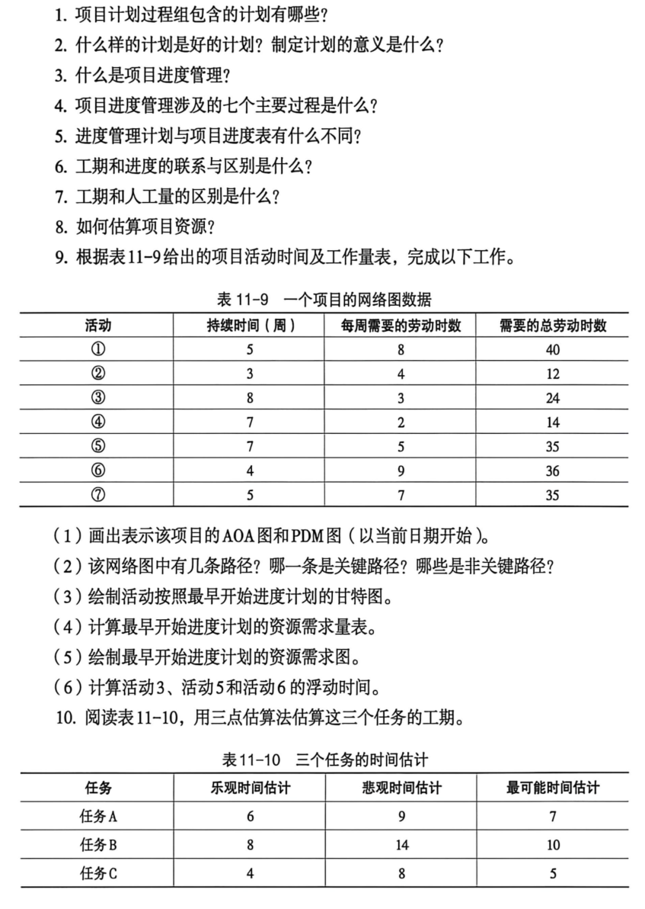

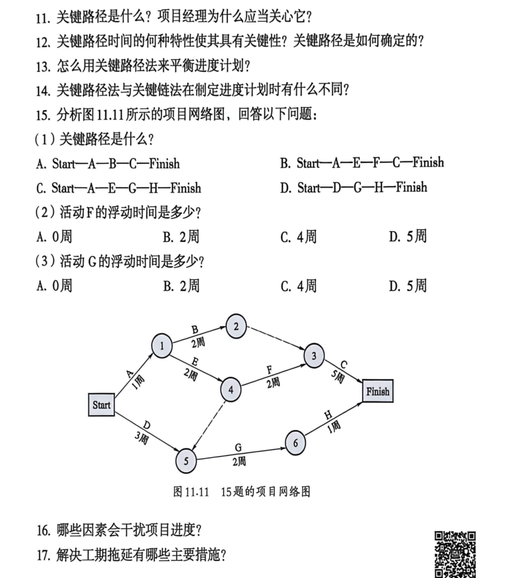

### 习题 1

**题目**：项目计划过程组包含的计划有哪些？

**参考答案**（仅供参考）

范围、进度、成本、质量、资源、沟通、风险、采购等**管理计划**（各知识领域）。

### 习题 2

**题目**：什么样的计划是好的计划？制定计划的意义是什么？

**参考答案**（仅供参考）

好计划：目标明确、可执行、可测量、有弹性、干系人认可。意义：统一方向、分配资源、控制基准、降不确定性。

### 习题 3

**题目**：什么是项目进度管理？

**参考答案**（仅供参考）

项目进度管理：确保项目按时完成，协调各过程组中的进度活动。

### 习题 4

**题目**：项目进度管理涉及的七个主要过程是什么？

**参考答案**（仅供参考）

规划进度管理、定义活动、排列顺序、估算持续时间、制定进度计划、控制进度（教材常列七项含相关子过程）。

### 习题 5

**题目**：进度管理计划与项目进度表有什么不同？

**参考答案**（仅供参考）

进度管理计划 = 如何管进度（程序）；项目进度表 = 具体活动与日期安排（甘特/网络）。

### 习题 6

**题目**：工期和进度的联系与区别是什么？

**参考答案**（仅供参考）

工期 = 完成活动所需日历时间；进度 = 活动在时间轴上的安排（何时开始/结束）。

### 习题 7

**题目**：工期和人工量的区别是什么？

**参考答案**（仅供参考）

人工量 = 完成活动所需总劳动时数（= 工期 × 每周工时等）。

### 习题 8

**题目**：如何估算项目资源？

**参考答案**（仅供参考）

类比、参数、自下而上、三点估算、专家判断；结合资源日历。

### 习题 9

**题目**：根据表11-9完成：AOA/PDM图、路径分析、甘特图、资源需求、活动③⑤⑥浮动时间。

**参考答案**（官方 PDF）

**（PDF 参考答案）**

**表 11-9 补充前导/后继关系**（P310）：

| 活动 | 前导 | 后继 | 工期(周) |
| --- | --- | --- | --- |
| ① | 开始 | ③,④ | 5 |
| ② | 开始 | ③,④ | 3 |
| ③ | ①,② | ⑥ | 8 |
| ④ | ①,② | ⑥ | 7 |
| ⑤ | 开始 | ⑥ | 7 |
| ⑥ | ④,⑤ | ⑦ | 4 |
| ⑦ | ⑥ | 结束 | 5 |

**(2) 路径**：共 **5 条路径**；**关键路径：①-③-⑥-⑦，工期 22 周**

**(6) 浮动时间**  
- **活动③**：在关键路径上，**浮动时间 0**  
- **活动⑤**：在非关键路径 ⑤-⑥-⑦（7+4+5=16 周），**浮动时间 6 周**（ES=0，EF=7，LS=7，LF=13）  
- **活动⑥**：在关键路径上，**浮动时间 0**

**(3)(4)(5)**：甘特图、资源需求表、资源负荷图见 PDF 原图（按最早开始排程）。

**解题方法**：画 AOA/PDM → 枚举路径 → 最长=关键 → 时差=关键路径长−所在路径长。

### 习题 10

**题目**：根据表11-10用三点估算法估算工期。

**参考答案**（官方 PDF）

**（PDF 参考答案）**

Te = (To + 4Tm + Tp) / 6

| 任务 | 计算 | Te |
| --- | --- | --- |
| A | (6+9+4×7)/6 | **7.2** |
| B | (8+14+4×10)/6 | **10.3** |
| C | (4+8+4×5)/6 | **5.3** |

（PDF 单位为「天」，教材表头为「周」，以课堂/PDF 为准）

**解题方法**：三点估算公式，m 权重为 4。

### 习题 11

**题目**：关键路径是什么？项目经理为什么应当关心它？

**参考答案**（仅供参考）

关键路径：决定项目最早完成时间的最长路径，时差最小。项目经理须优先保障，否则整体延期。

### 习题 12

**题目**：关键路径时间的何种特性使其具有关键性？关键路径是如何确定的？

**参考答案**（仅供参考）

关键性：路径总时长最长、浮动时间最少（为 0）。确定：枚举所有路径，取最长。

### 习题 13

**题目**：怎么用关键路径法来平衡进度计划？

**参考答案**（仅供参考）

压缩关键活动（赶工）、快速跟进（并行）、资源调配、利用非关键活动时差。

### 习题 14

**题目**：关键路径法与关键链法在制定进度计划时有什么不同？

**参考答案**（仅供参考）

CPM：逻辑依赖+最长路径；CCPM：加资源约束与项目/接驳缓冲，适合多项目争资源。

### 习题 15

**题目**：分析图11.11：关键路径选项；活动F、G的浮动时间。

**参考答案**（官方 PDF）

**（PDF 参考答案）**

(1) 关键路径：**B**（Start-A-E-F-C-Finish，10 周；与 Start-D-虚-F-C-Finish 等长）  
(2) 活动 F 浮动时间：**A. 0 周**  
(3) 活动 G 浮动时间：**C. 4 周**

**解题方法**：枚举四路径 → 最长 10 周 → 关键路径上时差 0。

### 习题 16

**题目**：哪些因素会干扰项目进度？

**参考答案**（仅供参考）

需求变更、资源不足、技术难题、沟通不畅、外部依赖、风险事件等。

### 习题 17

**题目**：解决工期拖延有哪些主要措施？

**参考答案**（仅供参考）

赶工、快速跟进、缩小范围、优化关键路径、加强监控预警、使用缓冲（CCPM）。

---

# 第12章 工程项目成本管理

> 官方答案：`第12章 工程项目成本管理的课后作业题目及参考答案.pdf`（计算/必做题以 PDF 为准）
> 无官方 PDF 的习题见下方「仅供参考」补充答案。

## 教材原题（截图）

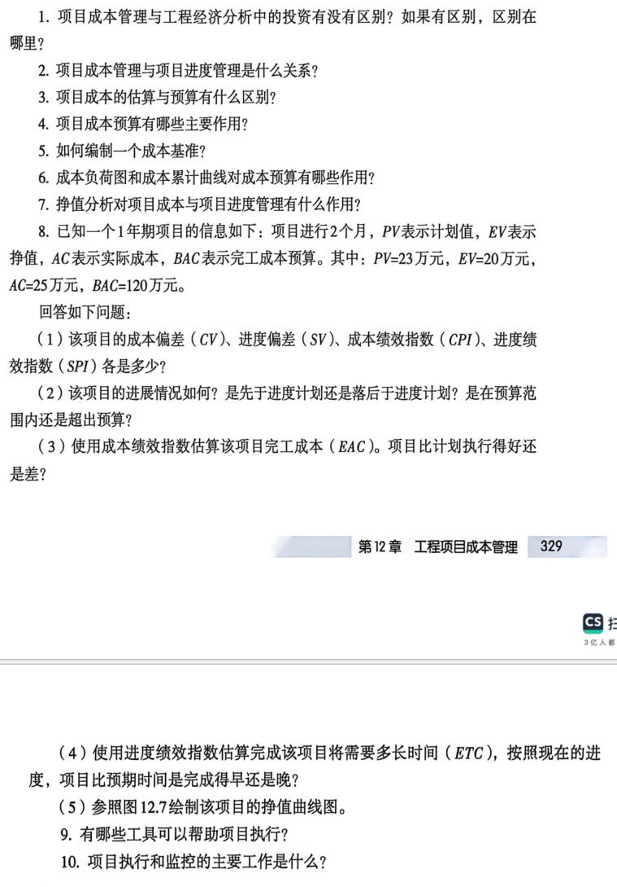

### 习题 1

**题目**：项目成本管理与工程经济分析中的投资有没有区别？如果有区别，区别在哪里？

**参考答案**（仅供参考）

工程经济：立项前可行性、NPV/IRR；项目成本管理：执行期预算控制、挣值偏差。阶段与工具不同。

### 习题 2

**题目**：项目成本管理与项目进度管理是什么关系？

**参考答案**（仅供参考）

共用 WBS 与进度基准；挣值法同时给 SPI（进度）与 CPI（成本）。

### 习题 3

**题目**：项目成本的估算与预算有什么区别？

**参考答案**（仅供参考）

估算 = 资源定量评估；预算 = 汇总分配至 WBS 形成成本基准。

### 习题 4

**题目**：项目成本预算有哪些主要作用？

**参考答案**（仅供参考）

控制支出、分配资源、绩效测量基准、预测现金流。

### 习题 5

**题目**：如何编制一个成本基准？

**参考答案**（仅供参考）

由 WBS 底层估算汇总 → 按时间段分配 → 批准形成成本基准（不含管理储备）。

### 习题 6

**题目**：成本负荷图和成本累计曲线对成本预算有哪些作用？

**参考答案**（仅供参考）

负荷图：各时段支出，资源平衡；S 曲线：累计成本对比计划与实际趋势。

### 习题 7

**题目**：挣值分析对项目成本与项目进度管理有什么作用？

**参考答案**（仅供参考）

同时监控成本与进度偏差，预测 EAC，支持纠偏。

### 习题 8

**题目**：已知PV=23万，EV=20万，AC=25万，BAC=120万（项目进行2个月）。求CV/SV/CPI/SPI、判读、EAC、ETC、挣值曲线。

**参考答案**（官方 PDF）

**（PDF 参考答案）**

**(1)**  
- CV = EV−AC = 20−25 = **−5 万元**  
- SV = EV−PV = 20−23 = **−3 万元**  
- CPI = EV/AC = 20/25 = **0.8**  
- SPI = EV/PV = 20/23 = **0.87**

**(2)** CV<0、CPI<1 → **成本超支**；SV<0、SPI<1 → **进度落后**

**(3)** EAC = BAC/CPI = 120/0.8 = **150 万元**；EAC>BAC → **比计划执行差**

**(4)** 预算工期 BTC=12 月，ETC = BTC/SPI = 12/0.87 ≈ **13.8 月**；尚需 13.8−2 = **11.8 月**；比预算**晚约 1.8 月**

**(5)** 挣值曲线图见 PDF 图 12.8（略）

**解题方法**：抄 PV/EV/AC/BAC → CV/SV/CPI/SPI → 判读 → EAC=BAC/CPI。

### 习题 9

**题目**：有哪些工具可以帮助项目执行？

**参考答案**（仅供参考）

项目管理软件、挣值分析、变更控制、状态会议、风险登记册等。

### 习题 10

**题目**：项目执行和监控的主要工作是什么？

**参考答案**（仅供参考）

按基准实施、收集绩效、对比偏差、纠正与变更控制、向干系人报告。

---

# 第13章 工程项目质量与风险管理

> **参考答案（仅供参考）**：综合《工程概论》教材、`notes/` 分章笔记、课件与 MOOC 要点整理，**非官方标准答案**；开放题、案例分析题需结合个人专业与项目举例。

## 教材原题（截图）

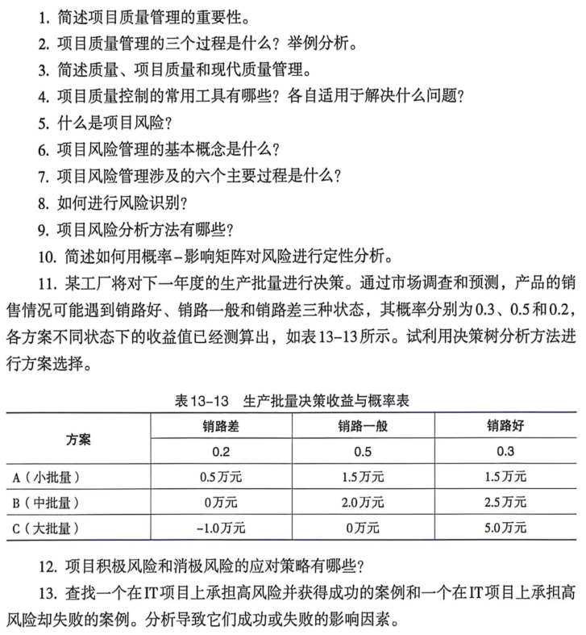

### 习题 1

**题目**：简述项目质量管理的重要性。

**参考答案**（仅供参考）

质量决定客户满意与项目成功；减少返工成本；关系安全与伦理（如杜绝豆腐渣工程）。

### 习题 2

**题目**：项目质量管理的三个过程是什么？举例分析。

**参考答案**（仅供参考）

规划质量管理、实施质量保证、控制质量。例：规划定标准→保证审计过程→控制检测缺陷。

### 习题 3

**题目**：简述质量、项目质量和现代质量管理。

**参考答案**（仅供参考）

质量 = 满足要求的程度；项目质量 = 成果符合标准与干系人期望；现代质量管理：检验→统计→TQM/PDCA。

### 习题 4

**题目**：项目质量控制的常用工具有哪些？各自适用于解决什么问题？

**参考答案**（仅供参考）

检因帕直控散流：检查表（记缺陷）、因果图（根因）、帕累托（关键少数）、直方图（分布）、控制图（过程稳定）、散点图（相关）、流程图（过程瓶颈）。

### 习题 5

**题目**：什么是项目风险？

**参考答案**（仅供参考）

项目风险：不确定事件或条件，对目标产生正面或负面影响。

### 习题 6

**题目**：项目风险管理的基本概念是什么？

**参考答案**（仅供参考）

通过识别、分析、应对、监控，将风险控制在可接受范围；风险值=概率×影响。

### 习题 7

**题目**：项目风险管理涉及的六个主要过程是什么？

**参考答案**（仅供参考）

规划风险管理、识别、定性分析、定量分析、规划应对、实施应对、监督风险。

### 习题 8

**题目**：如何进行风险识别？

**参考答案**（仅供参考）

头脑风暴、德尔菲、检查表、SWOT、假设分析、访谈、历史资料等。

### 习题 9

**题目**：项目风险分析方法有哪些？

**参考答案**（仅供参考）

定性：概率-影响矩阵；定量：决策树 EMV、蒙特卡洛、敏感性分析。

### 习题 10

**题目**：简述如何用概率-影响矩阵对风险进行定性分析。

**参考答案**（仅供参考）

横轴影响、纵轴概率 → 划分高/中/低优先级 → 优先处理高风险。

### 习题 11

**题目**：表13-13生产批量决策：销路差(0.2)/一般(0.5)/好(0.3)，用决策树选方案。

**参考答案**（仅供参考）

EMV：A=0.2×0.5+0.5×1.5+0.3×1.5=**1.30万**；B=0.2×0+0.5×2.0+0.3×2.5=**1.75万**；C=0.2×(−1)+0.5×0+0.3×5=**1.30万**
**选 B（中批量）**。

### 习题 12

**题目**：项目积极风险和消极风险的应对策略有哪些？

**参考答案**（仅供参考）

威胁：规避、承担、转移、缓解；机会：开发、共享、增强、承担。

### 习题 13

**题目**：查找IT项目高风险成功与失败案例，分析影响因素。

**参考答案**（仅供参考）

开放题：成功例（敏捷迭代控风险）vs 失败例（大型 ERP 范围失控）；从范围、进度、干系人、技术风险分析。

---

## 解题方法总结（PDF 覆盖章节）

| 题型 | 判型 | 流水线 |
| --- | --- | --- |
| 名义/实际利率 | 计息周期≠年 | 周期利率→复利→有效年利率 |
| 资本回收 A/P | 借P、n年等额还 | (A/P,i,n) 或 PMT |
| 预付年金 | 年初收付 | 普通年金×(1+i) |
| 方案现值比选 | 两串现金流 | 折到 t=0 比 PV |
| 税后 NPV/PBT | 设备+折旧+税 | NCF表→累计→PBT→NPV |
| IRR | NCF序列 | IRR≥i₀ 可行 |
| 敏感性 | 单因素变 NPV | 敏感度=NPV变率/因素变率 |
| 本量利 | 定价/保本/利润 | 三公式连算 |
| 网络图 | 表11-9+依赖 | 路径→关键→时差 |
| 三点估算 | 给 a,m,b | (a+4m+b)/6 |
| 挣值 | PV/EV/AC/BAC | CV/SV/CPI/SPI/EAC |

---

*生成：`课后题/_build_doc.py` + `ref_answers.py`；PDF 提取：`课后题/_pdf_extract.txt`*